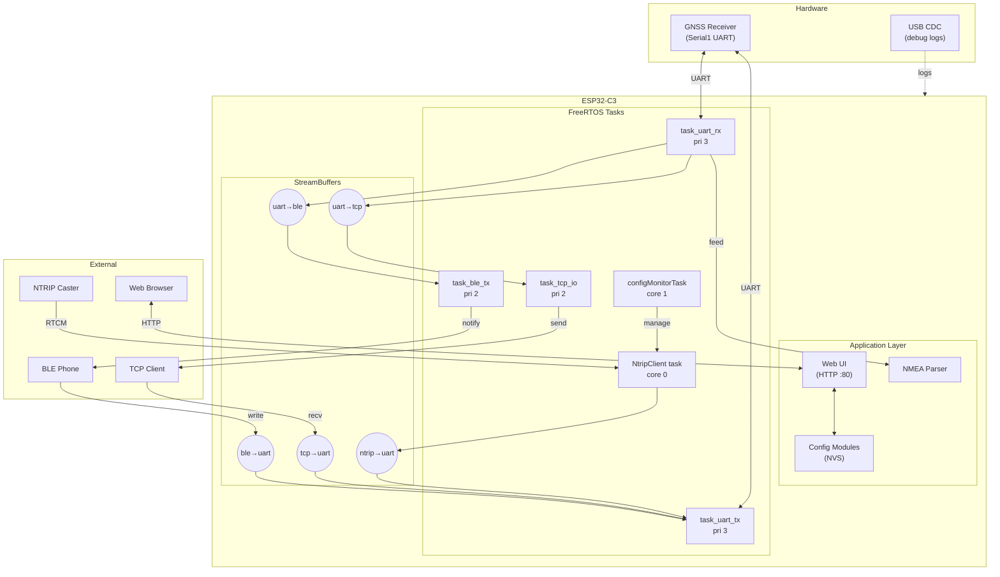
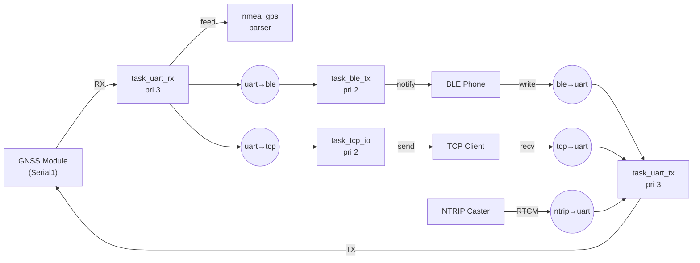
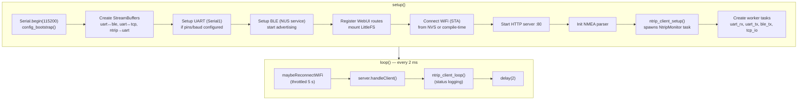
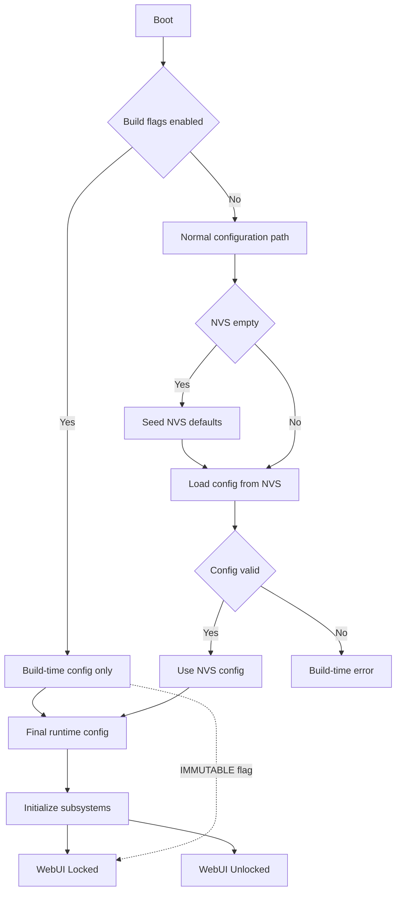
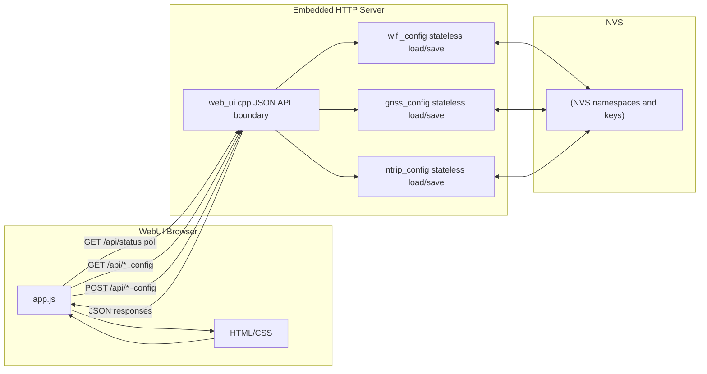
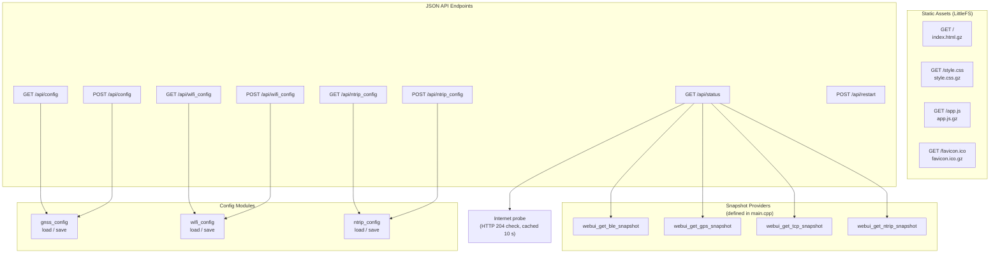
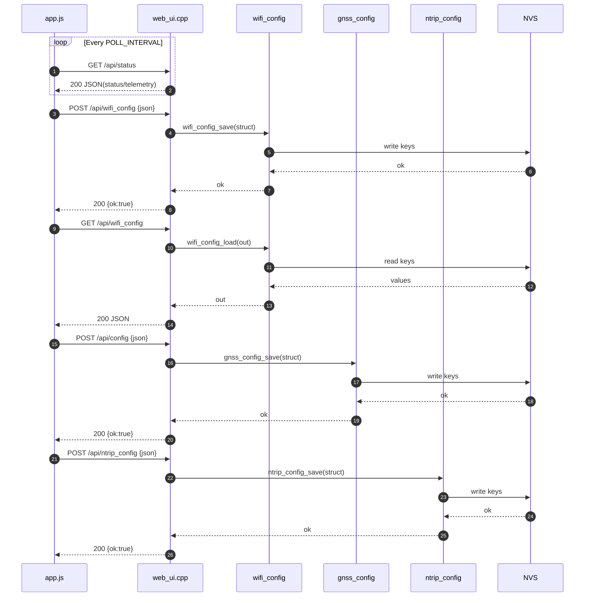
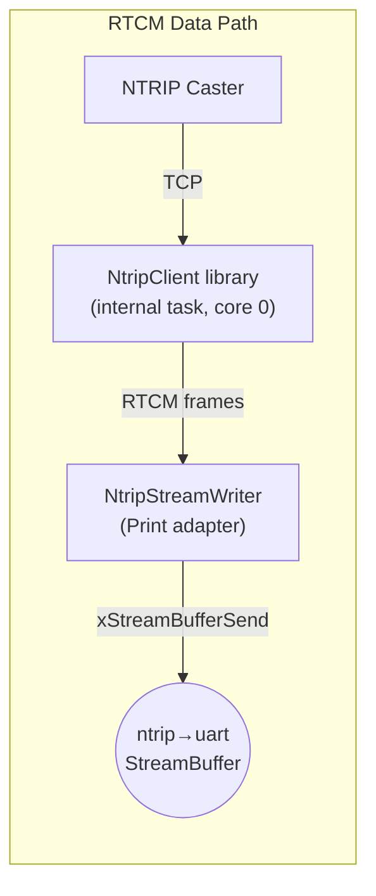
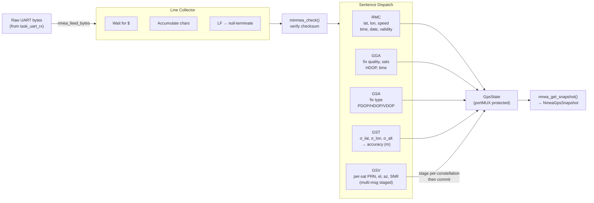

# GNSS-ESP32 Codebase Reference

> ESP32-C3 GNSS RTK system — UART bridge with BLE, TCP, NTRIP, Web UI

---

## Table of Contents

- [Project Layout](#project-layout)
- [Architecture Overview](#architecture-overview)
- [Data Flow](#data-flow)
- [Boot Sequence](#boot-sequence)
- [FreeRTOS Tasks](#freertos-tasks)
- [Configuration System](#configuration-system)
- [NVS Schema](#nvs-schema)
- [HTTP API](#http-api)
- [NTRIP Connection Manager](#ntrip-connection-manager)
- [NMEA Parser](#nmea-parser)
- [ntrip-client Library](#ntrip-client-library)
- [Build Flags](#build-flags)
- [Flash Partition Layout](#flash-partition-layout)
- [Tooling](#tooling)

---

## Project Layout

```
gnss/
├── include/
│   ├── app.h                 # Centralized build-flag defaults & tunables
│   ├── config_bootstrap.h    # One-time NVS seeding
│   ├── gnss_config.h         # GnssConfig struct & load/save API
│   ├── wifi_config.h         # WifiConfig struct & load/save API
│   ├── ntrip_config.h        # NtripConfig + NtripLockout structs & API
│   ├── ntrip_client.h        # NtripClientSnapshot & setup/loop API
│   ├── web_ui.h              # Snapshot structs (BLE/TCP/GPS/NTRIP) & webui_begin()
│   ├── nmea_gps.h            # NmeaGpsSnapshot & nmea_feed_bytes() API
│   ├── nvs_keys.h            # NVS namespace/key constants (single source of truth)
│   └── logger.h              # LOG_I/W/E/D macros & per-file MODULE_LOG gate
├── src/
│   ├── main.cpp              # Arduino entry, FreeRTOS tasks, UART/BLE/TCP bridge
│   ├── config_bootstrap.cpp  # Seeds NVS defaults on first boot
│   ├── gnss_config.cpp       # GNSS pin/baud NVS persistence
│   ├── wifi_config.cpp       # WiFi STA credential NVS persistence
│   ├── ntrip_config.cpp      # NTRIP caster + lockout NVS persistence
│   ├── ntrip_client.cpp      # NTRIP connection manager (monitor task)
│   ├── web_ui.cpp            # REST JSON API server & static file serving
│   ├── nmea_gps.cpp          # NMEA 0183 parser (RMC/GGA/GSA/GST/GSV)
│   └── logger.cpp            # logToSerial() implementation
├── lib/
│   ├── ntrip-client/         # Embedded NTRIP client library (v2.1.0)
│   │   ├── include/NtripClient.h
│   │   ├── include/RtcmParser.h
│   │   ├── src/NtripClient.cpp
│   │   ├── src/RtcmParser.cpp
│   │   └── examples/         # minimal/ and basic/
│   └── minmea/               # Lightweight NMEA 0183 C parser
├── data/
│   └── web/                  # Web UI assets (HTML/CSS/JS) → gzipped for LittleFS
├── build/                    # Dockerfile, create-data-bin.sh, docker-export-bins.sh
├── utils/
│   ├── build-tester/         # PlatformIO build-flag validation (27 test cases)
│   ├── nvs-tester/           # NVS key consistency checker (nvs_keys.h ↔ CSV)
│   ├── uploader/             # GUI flash tool (LittleFS + NVS partition)
│   └── render-web/           # Web asset pre-processing
├── platformio.ini            # Build configuration (env:full)
└── partitions.csv            # Flash partition table
```

---

## Architecture Overview



---

## Data Flow



### StreamBuffer Sizes

| Buffer | Size | Direction | Purpose |
|--------|------|-----------|---------|
| `SB_UART_TO_BLE` | 4 KB | GNSS → Phone | Continuous NMEA stream |
| `SB_BLE_TO_UART` | 16 KB | Phone → GNSS | RTCM correction bursts |
| `SB_UART_TO_TCP` | 2 KB | GNSS → TCP | Mirror of BLE stream |
| `SB_TCP_TO_UART` | 4 KB | TCP → GNSS | RTCM correction bursts |
| `SB_NTRIP_TO_UART` | 4 KB | Caster → GNSS | NTRIP RTCM corrections |

All buffers use trigger level = 1 (wake on first byte).

---

## Boot Sequence



### config_bootstrap() Detail



---

## FreeRTOS Tasks

| Task | Priority | Core | Stack | Purpose |
|------|----------|------|-------|---------|
| `task_uart_rx` | 3 | any | — | Read GNSS UART → fan out to BLE/TCP/NMEA buffers |
| `task_uart_tx` | 3 | any | — | Merge BLE/TCP/NTRIP buffers → write GNSS UART |
| `task_ble_tx` | 2 | any | — | Drain uart→ble buffer → BLE notifications |
| `task_tcp_io` | 2 | any | — | Bidirectional TCP ↔ uart stream copy |
| `configMonitorTask` | — | 1 | — | NTRIP config hot-reload, internet checks (1 s loop) |
| NtripClient internal | — | 0 | — | TCP connection to NTRIP caster, RTCM parsing |

### Thread Safety Model

- **StreamBuffers**: FreeRTOS-native thread-safe ring buffers for all inter-task data
- **NMEA state**: `portMUX` critical sections for double/float reads (32-bit MCU)
- **NTRIP stats**: `SemaphoreHandle_t` mutex, flushed every 250 ms
- **Snapshot structs**: Copy-on-read pattern for all web UI queries

---

## Configuration System

Three stateless config modules share an identical API pattern:

```
*_config_defaults()  → struct with safe defaults
*_config_validate()  → bool + error string
*_config_load()      → read from NVS
*_config_save()      → write to NVS
```



### Structs

```cpp
struct GnssConfig {
  int      rx_pin;
  int      tx_pin;
  uint32_t baud;
};

struct WifiConfig {
  String    ssid, pass;
  bool      dhcp;
  IPAddress ip, gw, subnet, dns;
};

struct NtripConfig {
  bool     enabled;
  String   host, mount, user, pass;
  uint16_t port;
  int      max_tries;
  uint32_t retry_delay_ms, health_timeout_ms;
  uint32_t passive_sample_ms, required_valid_frames;
  uint32_t buffer_size, connect_timeout_ms;
};

struct NtripLockout {
  int    failed_attempts;
  bool   abandoned;
  String last_config_hash;
};
```

### Immutability Rules

| Subsystem | Immutable when | Effect |
|-----------|----------------|--------|
| UART | `FORCE_HARDCODED_UART=1` | Pins/baud from build flags; WebUI POST rejected |
| WiFi | `FORCE_WIFI_SECRETS=1` or `!WIFI_ENABLE` | Credentials from `secrets.h`; WebUI POST rejected |
| NTRIP | `!NTRIP_CLIENT_ENABLE` | Config section hidden; NVS not seeded |

---

## NVS Schema

Version: `NVS_SCHEMA_VERSION = 1` (defined in `nvs_keys.h`)

### Namespace `gnss` (3 keys)

| Key | Type | Default | Description |
|-----|------|---------|-------------|
| `rx_pin` | int | -1 | GNSS UART RX pin |
| `tx_pin` | int | -1 | GNSS UART TX pin |
| `baud` | uint32 | 115200 | GNSS UART baud rate |

### Namespace `wifi` (8 keys)

| Key | Type | Default | Description |
|-----|------|---------|-------------|
| `ssid` | string | "" | WiFi STA SSID |
| `pass` | string | "" | WiFi STA password |
| `dhcp` | bool | false | Use DHCP |
| `ip` | string | "192.168.1.200" | Static IP |
| `gw` | string | "192.168.1.1" | Gateway |
| `subnet` | string | "255.255.255.0" | Subnet mask |
| `dns` | string | "8.8.8.8" | DNS server |
| `accesspoint` | string | "" | SoftAP config |

### Namespace `ntrip` (13 config + 3 lockout = 16 keys)

| Key | Type | Default | Description |
|-----|------|---------|-------------|
| `enabled` | bool | false | Enable NTRIP client |
| `host` | string | "" | Caster hostname |
| `port` | uint16 | 2101 | Caster port |
| `mount` | string | "" | Mountpoint |
| `user` | string | "" | Username |
| `pass` | string | "" | Password |
| `max_tries` | int | 5 | Max reconnect attempts |
| `retry_delay` | uint32 | 5000 | Retry delay (ms) |
| `health_to` | uint32 | 30000 | Health timeout (ms) |
| `passive_ms` | uint32 | 1000 | Passive sample interval (ms) |
| `req_valid` | uint32 | 3 | Required valid frames |
| `buf_size` | uint32 | 2048 | Buffer size (bytes) |
| `conn_to` | uint32 | 10000 | Connect timeout (ms) |
| `lock_fails` | int | 0 | Lockout: failed attempts |
| `lock_aband` | bool | false | Lockout: abandoned flag |
| `lock_hash` | string | "" | Lockout: config hash |

---

## HTTP API



### Endpoints

| Method | Path | Description |
|--------|------|-------------|
| GET | `/` | Serve `index.html.gz` |
| GET | `/style.css` | Serve `style.css.gz` |
| GET | `/app.js` | Serve `app.js.gz` |
| GET | `/favicon.ico` | Serve `favicon.ico.gz` |
| GET | `/api/status` | System telemetry (BLE, GPS, TCP, NTRIP, internet) |
| GET | `/api/config` | Read GNSS config |
| POST | `/api/config` | Write GNSS config |
| GET | `/api/wifi_config` | Read WiFi config |
| POST | `/api/wifi_config` | Write WiFi config |
| GET | `/api/ntrip_config` | Read NTRIP config |
| POST | `/api/ntrip_config` | Write NTRIP config |
| POST | `/api/restart` | Reboot ESP32 |

### Sequence



### Snapshot Structs

```cpp
struct WebuiBleSnapshot {
  bool connected; uint16_t mtu;
  uint32_t txBytes, rxBytes;
  uint32_t uart2bleDrops, ble2uartDrops;
};

struct WebuiTcpSnapshot {     // TCP_ENABLE only
  bool connected;
  uint32_t txBytes, rxBytes;
  uint32_t uart2tcpDrops, tcp2uartDrops;
};

struct WebuiGpsSnapshot {     // NMEA_ENABLE only
  bool valid; double lat, lon; float speedKmh;
  uint8_t satsUsed, fixQuality, fixType; float hdop;
  float hAcc_m, vAcc_m; uint8_t accSource;
  bool timeValid; uint8_t hour, minute, second;
  uint16_t year; uint8_t month, day;
  uint32_t ageMs;
  uint8_t satCount; WebuiSatInfo sats[48];
};

struct WebuiNtripSnapshot {   // NTRIP_CLIENT_ENABLE only
  bool connected, healthy, streaming;
  uint32_t bytesReceived, totalFrames;
  uint16_t lastMessageType; uint32_t lastFrameAgeMs;
};
```

---

## NTRIP Connection Manager

`src/ntrip_client.cpp` — manages the NTRIP library lifecycle with config hot-reload.


### RTCM Data Path



---

## NMEA Parser

`src/nmea_gps.cpp` — byte-level NMEA 0183 parser using the `minmea` C library.

Supported sentences: **RMC**, **GGA**, **GSA**, **GST**, **GSV**



### Constellation IDs

| ID | Constellation |
|----|---------------|
| 0 | GPS |
| 1 | GLONASS |
| 2 | Galileo |
| 3 | BeiDou |
| 4 | Other |

GSV stale timeout: 10 s (`NMEA_GSV_STALE_MS`). Max satellites tracked: 48 (`NMEA_MAX_SATS`).

---

## ntrip-client Library

`lib/ntrip-client/` — standalone NTRIP Rev2 client with Rev1 fallback.

### State Machine

```
DISCONNECTED → CONNECTING → STREAMING → LOCKED_OUT
                    ↑            │
                    └────────────┘  (reconnect on error)
```

### RTCM Parser

`RtcmParser` — state-machine parser for RTCM 3.x frames:

```
Preamble (0xD3) → Length (10-bit) → Payload → CRC24Q (3 bytes)
```

States: `SYNC → LEN1 → LEN2 → PAYLOAD → CRC`

Two-phase validation:
1. **Startup**: Strict RTCM CRC parsing to confirm valid data
2. **Steady state**: Passive preamble sampling (configurable byte window)

### Library Build Flags

| Flag | Default | Purpose |
|------|---------|---------|
| `NTRIP_CLIENT_ENABLE_TASK` | 1 | FreeRTOS task mode vs manual loop |
| `NTRIP_CLIENT_ENABLE_REV1_FALLBACK` | 1 | Auto-fallback Rev2 → Rev1 |
| `NTRIP_CLIENT_PASSIVE_SCAN_BYTES` | 128 | Bytes scanned during passive health checks |

---

## Build Flags

All flags are set in `platformio.ini` and default in `app.h`.

### Feature Gates

| Flag | Default | Description |
|------|---------|-------------|
| `WEBUI_ENABLE` | 0 | HTTP server + REST API + LittleFS |
| `NMEA_ENABLE` | 0 | NMEA parser (requires `WEBUI_ENABLE`) |
| `TCP_ENABLE` | 0 | TCP server for UART bridging |
| `TCP_PORT` | 5000 | TCP listen port |
| `NTRIP_CLIENT_ENABLE` | 0 | NTRIP client (requires `WEBUI_ENABLE`) |
| `BLE_ENABLE` | 0 | BLE NUS UART bridge |
| `WIFI_ENABLE` | derived | Auto = `WEBUI_ENABLE \|\| TCP_ENABLE \|\| NTRIP_CLIENT_ENABLE` |

### Dependency Rules

```
NTRIP_CLIENT_ENABLE=1  →  requires WEBUI_ENABLE=1  (#error)
NMEA_ENABLE=1          →  requires WEBUI_ENABLE=1  (#warning, forced to 0)
```

### WiFi Configuration

| Flag | Default | Description |
|------|---------|-------------|
| `WIFI_DUAL_MODE` | 0 | 0 = STA only, 1 = STA + softAP |
| `STA_CHANNEL` | 0 | Fixed STA channel (0 = auto) |
| `SOFTAP_SSID_VALUE` | "GNSS-ESP32-AP" | SoftAP SSID |
| `SOFTAP_PASS_VALUE` | "" | SoftAP password (empty = open) |
| `SOFTAP_CHANNEL` | 6 | SoftAP channel |
| `SOFTAP_HIDDEN` | 0 | Hide SoftAP SSID |
| `SOFTAP_MAX_CONN` | 2 | Max SoftAP clients |
| `FORCE_WIFI_SECRETS` | 0 | Use compile-time credentials from `secrets.h` |

### UART / Hardware

| Flag | Default | Description |
|------|---------|-------------|
| `FORCE_HARDCODED_UART` | 0 | Lock UART config to build flags |
| `HARD_RX_PIN` | (required if forced) | GNSS RX pin |
| `HARD_TX_PIN` | (required if forced) | GNSS TX pin |
| `HARD_BAUD` | (required if forced) | GNSS baud rate |

### Logging

| Flag | Default | Description |
|------|---------|-------------|
| `GLOBAL_LOG_LEVEL` | 0 | 0=silent, 1=error, 2=warning, 3=info, 4=debug |
| `LOG_USE_COLOR` | 0 | ANSI color codes in serial output |

Per-file control: define `MODULE_LOG` (0 or 1) before `#include "logger.h"` in each `.cpp`.

### BLE Tunables

| Flag/Constant | Default | Description |
|---------------|---------|-------------|
| `BLE_DEVICE_NAME` | "GNSS-BLE" | BLE advertising name |
| `BLE_MTU_CFG` | 23 | Requested ATT MTU |
| `GNSS_HZ_CFG` | 1 | GNSS output rate (Hz) |

---

## Flash Partition Layout

Board: **Lolin C3 Mini** (ESP32-C3, 4 MB flash)

| Name | Type | Offset | Size | Purpose |
|------|------|--------|------|---------|
| `nvs` | data/nvs | 0x9000 | 24 KB | Non-volatile storage (config) |
| `app0` | app/factory | 0x10000 | 3 MB | Firmware |
| `spiffs` | data/spiffs | 0x310000 | 256 KB | LittleFS (web assets) |
| `coredump` | data/coredump | 0x350000 | 4 KB | Crash dumps |

### External Dependencies

| Library | Version | Purpose |
|---------|---------|---------|
| NimBLE-Arduino | ^2.3.7 | BLE stack (NUS service) |
| ArduinoJson | ^7.4.2 | JSON serialization for REST API |

---

## Tooling

### Build Tester (`utils/build-tester/`)

Validates all build-flag combinations compile correctly.

| Tier | Tests | Scope |
|------|-------|-------|
| A (Smoke) | 2 | Default + full production |
| B (Pairwise) | 15 | Feature gate combinations |
| C (Negative) | 2 | Constraint violations (expected failures) |

```bash
python build_Tester.py --tier A,B    # run smoke + pairwise
python build_Tester.py --list        # show all test cases
```

### NVS Tester (`utils/nvs-tester/`)

Validates `nvs_keys.h` C++ constants match the NVS partition CSV.

```bash
python check_nvs_keys.py  # exit 0 = consistent
```

### Uploader GUI (`utils/uploader/`)

PyQt/Tkinter GUI for flashing LittleFS + NVS partitions without PlatformIO.


### Logger Usage

```cpp
// At top of each .cpp file:
#define MODULE_LOG 1     // enable logs for this file
#include "logger.h"

LOG_I("SYS", "Boot v%s", APP_VERSION);       // info
LOG_W("TEMP", "Overheating: %d C", temp);     // warning
LOG_E("I2C", "Bus error");                    // error
LOG_D("MEM", "Free: %d", ESP.getFreeHeap());  // debug (level 4 only)
```
