## State Flow (Stateless Config Modules)
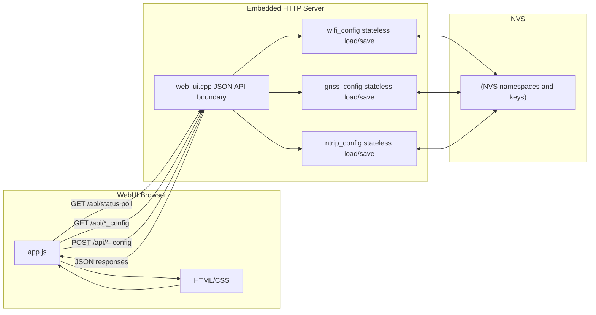

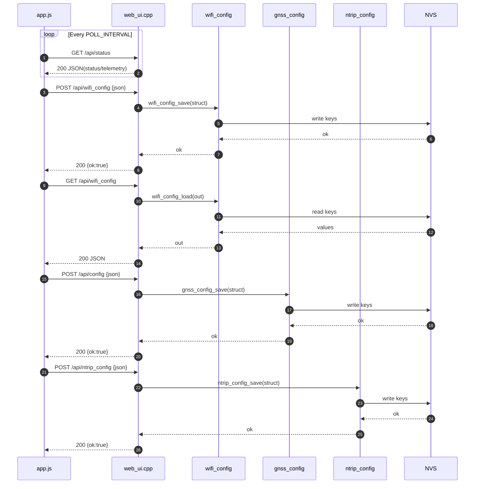

---

## main.cpp — Data Flow Architecture

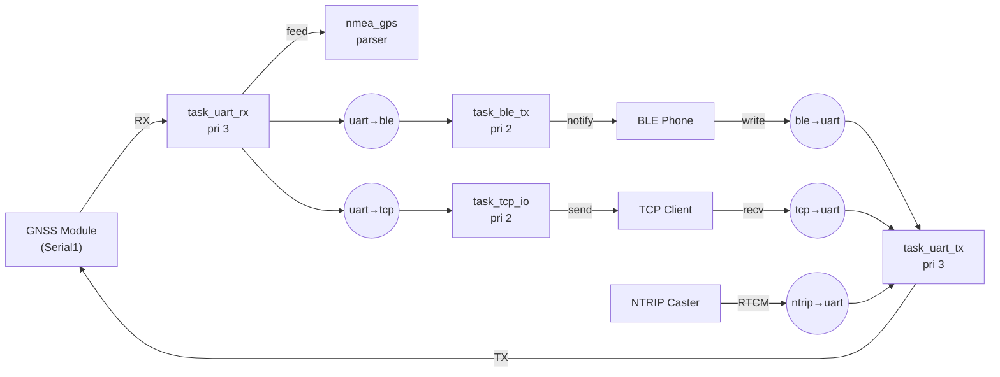

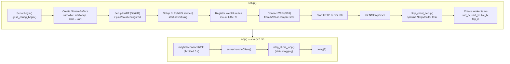

---

## web_ui.cpp — HTTP JSON API Boundary

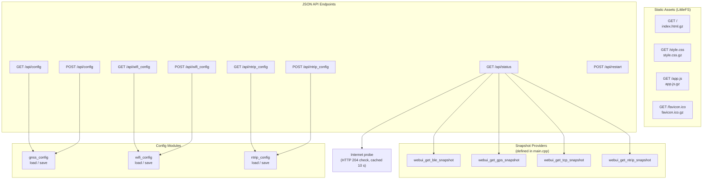

---

## ntrip_client.cpp — NTRIP Connection Manager

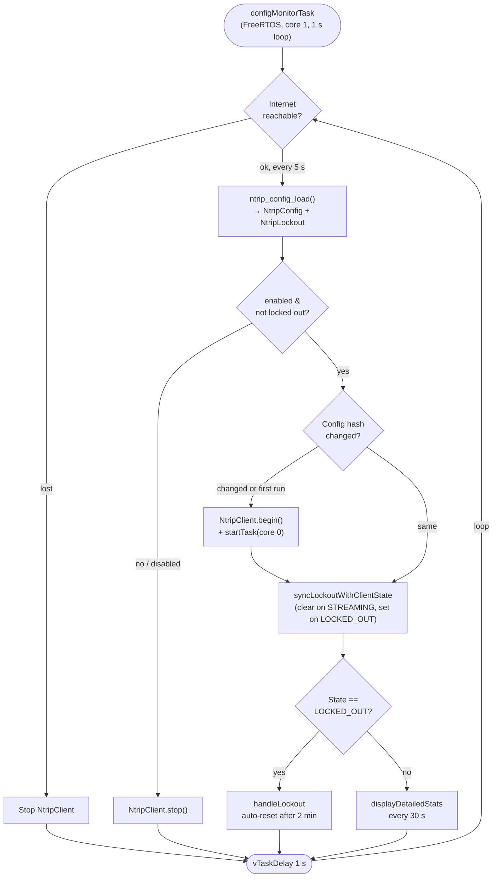

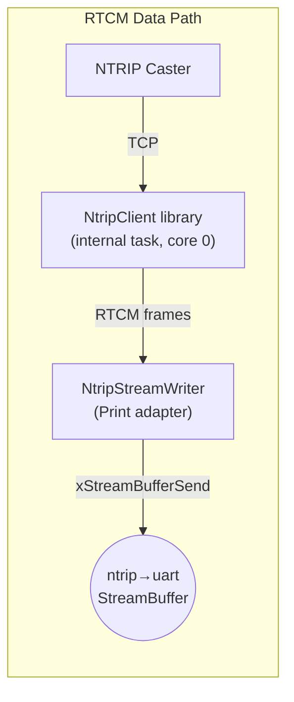

---

## nmea_gps.cpp — NMEA Sentence Parser

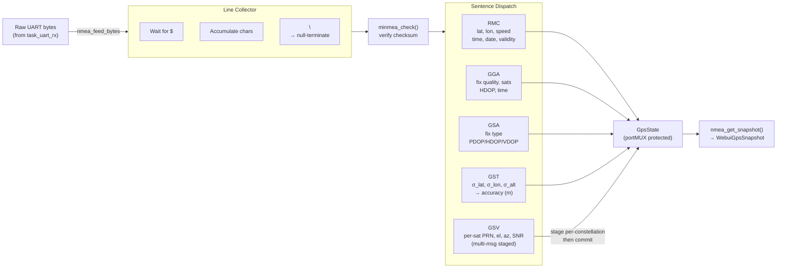

---

## wifi_config.cpp — WiFi Config Module

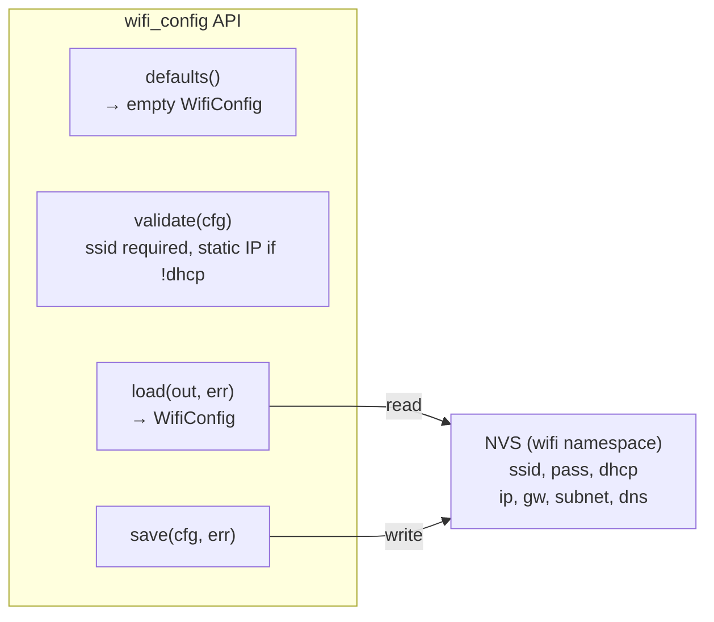

---

## gnss_config.cpp — GNSS Config Module

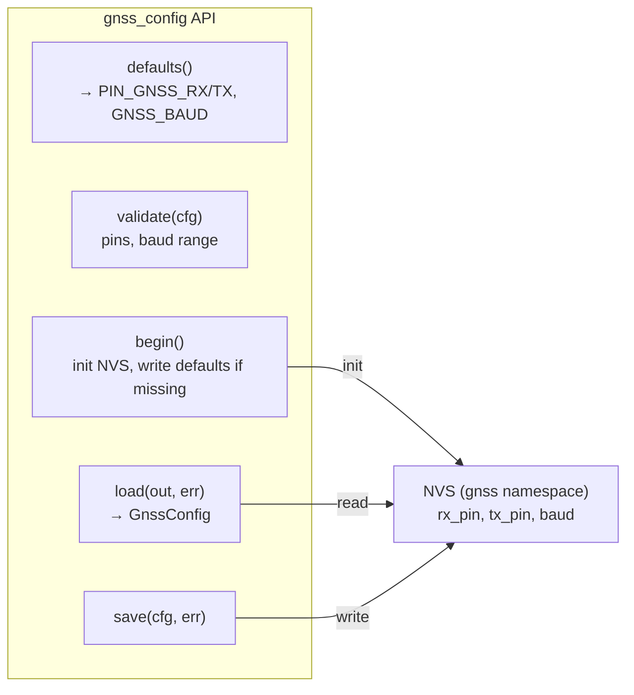

---

## ntrip_config.cpp — NTRIP Config Module

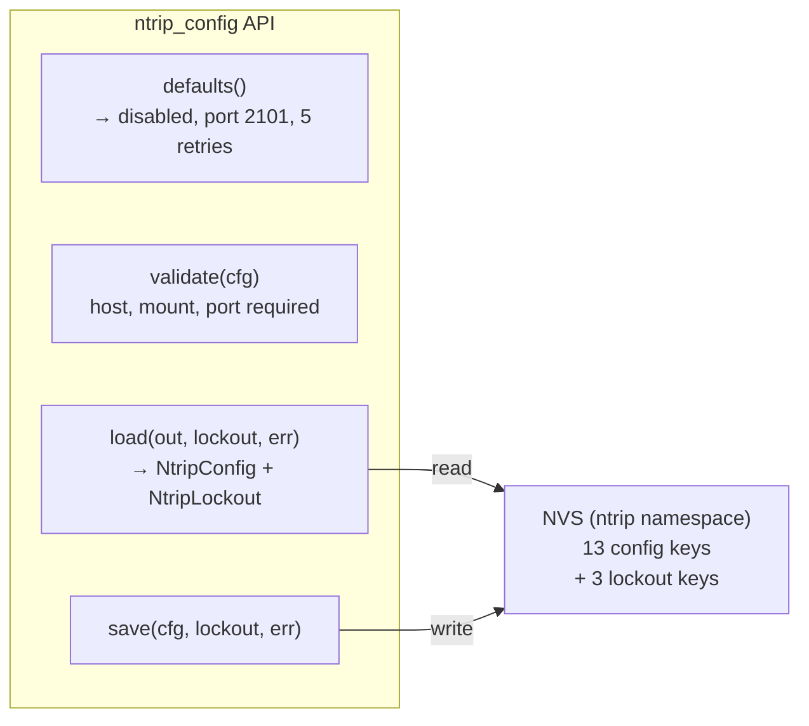

---

## logger.cpp — Serial Logger

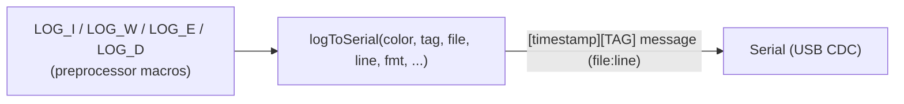
