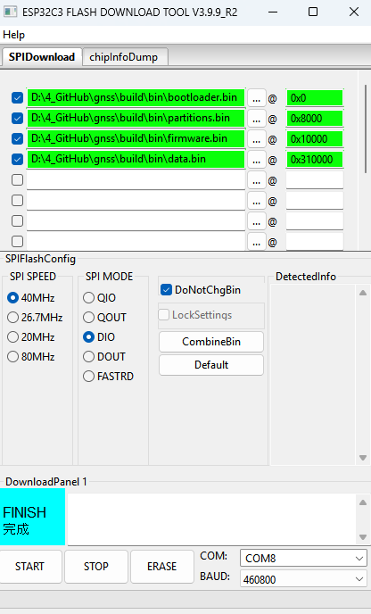
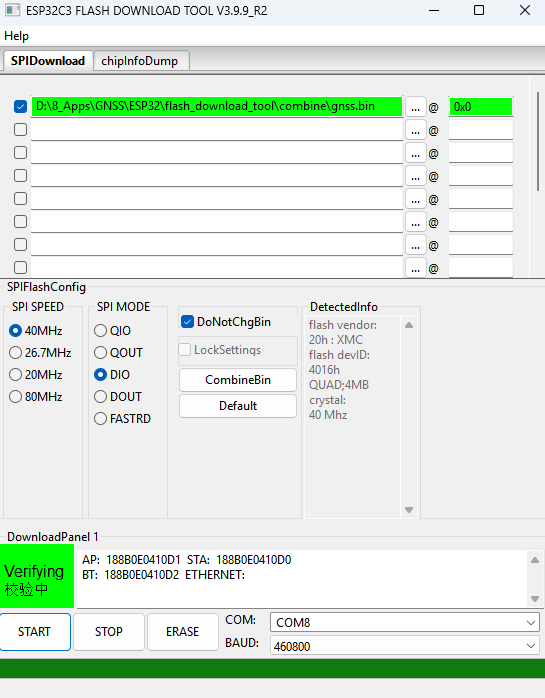
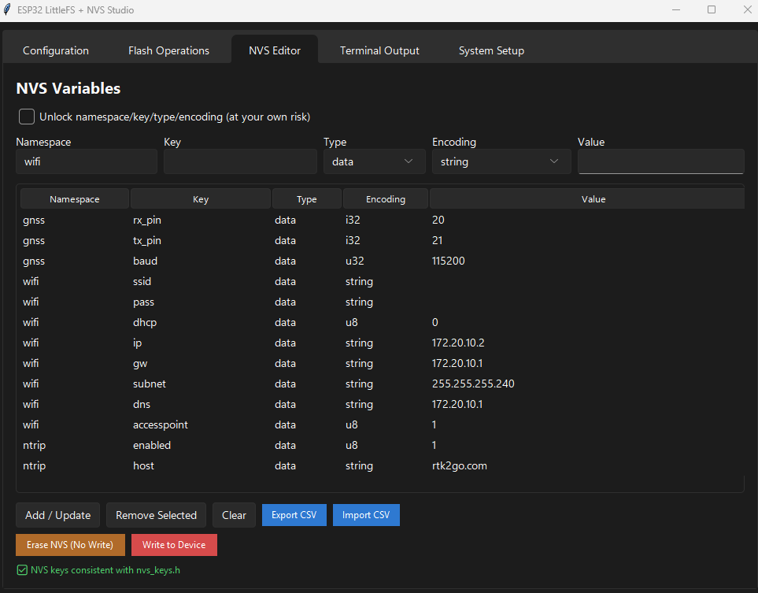

# Installation & Quickstart

## QuickStart : Flashing A Prebuilt Binary For ESP32-C3 ONLY

Use this when you want the fastest bring-up without building locally.

What you need:
- A GNSS (U-blox, Unicorn...)
- A USB cable for flashing and powering the ESP32 board
- An **ESP32-C3 board** with minimum 4M flash memory
- A prebuilt binary set (`bootloader.bin`, `partitions.bin`, `firmware.bin`, `data.bin`) provided in releases
- A flash tool (`esptool.py`, PlatformIO upload, or Espressif Flash Download Tool)

Typical offsets for this repo partition table (see *partitions.csv* ):
- `bootloader.bin` -> `0x0`
- `partitions.bin` -> `0x8000`
- `firmware.bin` -> `0x10000`
- `data.bin` -> `0x310000`

OR (the all-in one)
- `gnss.bin` -> `0x0`

  &nbsp;
  

After flashing, the firmware immediately:
- boots,
- seeds defaults (NVS) when mutable (i.e.: precedence of build flags),
- starts enabled features from build flags.

Important default behavior:
- UART defaults to unconfigured (`rx_pin=-1`, `tx_pin=-1`, `baud=0`)
- If you want to parse the NMEA in the webUI (and see the Skyplot...), the GNSS must output NMEA sentences to the ESP32's UART (configure also the RX/TX/BAUD in the webUI)
- In that unconfigured state, UART bridging is intentionally skipped until configured
- Connect to the WiFi Access Point "GNSS-ESP32-AP", then go to http://192.168.4.1
- After connecting, configure your GNSS UART settings, WiFi credentials, and NTRIP server details through the web interface (click on the flashing gear)

**Preload NVS settings (recommended for field deployment):**
- Use `utils/uploader/` to write GNSS/WiFi/NTRIP values to NVS and flash LittleFS web assets.
- See: https://github.com/entr0-pi/arduino-uploader.git

- This avoids going to the webUI just to change target wiring or network values
- Fill with your own paths, COM and board type
- Read the documentation to install the prerequisites

## Building From Source

Use this when you need to:
- use another board/chip,
- change feature flags,
- use another partition,
- modify firmware behavior.

The first two are low-risk (see below). The code support a partition layout (by reading in it) but there is a risk it is not comprehensive. For the last one, of course, it is risky unless you know what you do.

### Step 1: Retargeting to Another Board

The default build targets a ESP32-C3 (Lolin C3 Mini). To switch to a different ESP32 board:

1. Copy `.env.example` to `.env` at the project root
2. Edit the four variables (`TARGET_BOARD`, `TARGET_CHIP`, `TARGET_LABEL`, `TARGET_GNSS`)
3. Run `python utils/board/retarget.py --dry-run` to preview changes
4. Run `python utils/board/retarget.py` to apply

This updates `platformio.ini`, flash scripts, web UI strings, documentation, and bootloader offsets in one step. See `utils/board/BOARD_PORTING.md` for the full guide and available boards.

### Step 2: Building From Source

Prerequisites:
- Docker installed

**Build with Docker:** 
- change the flags in *platformio.ini*
- adapt the partition in *partition.csv*
- any other modifications in the codebase ***at your own risk***
- see README in /build (full automation in a docker container to make it platform-agnostic). Output in /bin for the binaries and the flash commands

Recommended workflow:
- Develop and validate UI behavior with `render-web`
- Validate firmware flag combinations with `build-tester`
- Produce deployable config + assets with `uploader`

**Preload NVS settings (recommended for field deployment):**
- See description in the previous section

## Utils 

Available tooling under `utils/`:
- `utils/board/retarget.py`: board retargeting script (see section C above)
- `utils/uploader`: NVS editor + writer, LittleFS builder/flasher
- `utils/render-web/render_web.py`: local dev server for `data/web/` with mock API
- `utils/build-tester/build_Tester.py`: build matrix tester for feature flags

Utils goals and when to use them:

1. `utils/board/` (board retargeting)
- Goal: switch the entire codebase to a different ESP32 board in one command.
- Reads `.env` and updates configs, build scripts, web UI, and docs.
- Best for: porting to a new board, maintaining multi-board variants.
- Expected outcome: all board-specific references are consistent after running the script.

2. `utils/uploader/` (deployment and field configuration)
- Goal: configure devices without rebuilding firmware.
- Use it to prepare and flash:
  - NVS key/values (GNSS UART, WiFi, NTRIP),
  - LittleFS image (Web UI assets).
- Best for: production setup, installer workflow, lab technicians.
- Expected outcome: device is flashed with firmware-compatible config and web assets in one workflow.

3. `utils/render-web/` (Web UI development loop)
- Goal: iterate quickly on Web UI outside embedded target constraints.
- Serves `data/web/` with mocked API endpoints that mimic firmware routes.
- Best for: frontend work, API contract checks, UI regression checks before flashing.
- Expected outcome: faster UI iteration with no board required for every change.

4. `utils/build-tester/` (compile-time flag validation)
- Goal: verify feature-flag combinations still compile as the project evolves.
- Runs tiered build matrices, including expected-failure guard tests.
- Best for: CI validation, pre-release sanity checks, refactor safety.
- Expected outcome: early detection of broken flag combinations and guard regressions.
