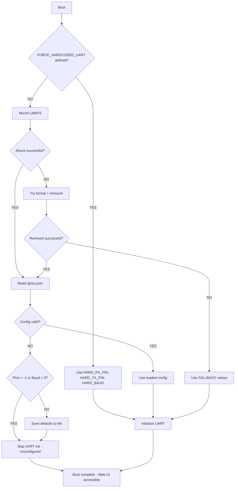
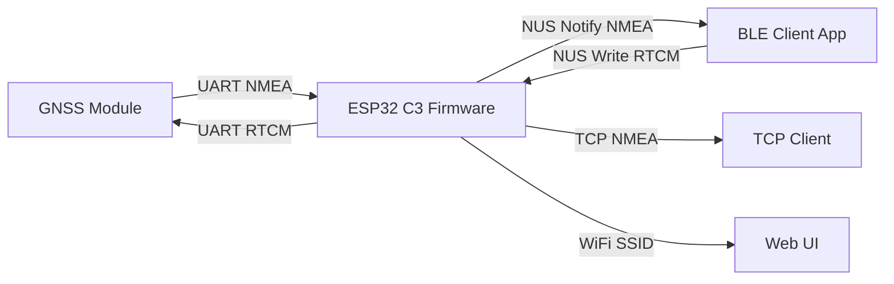
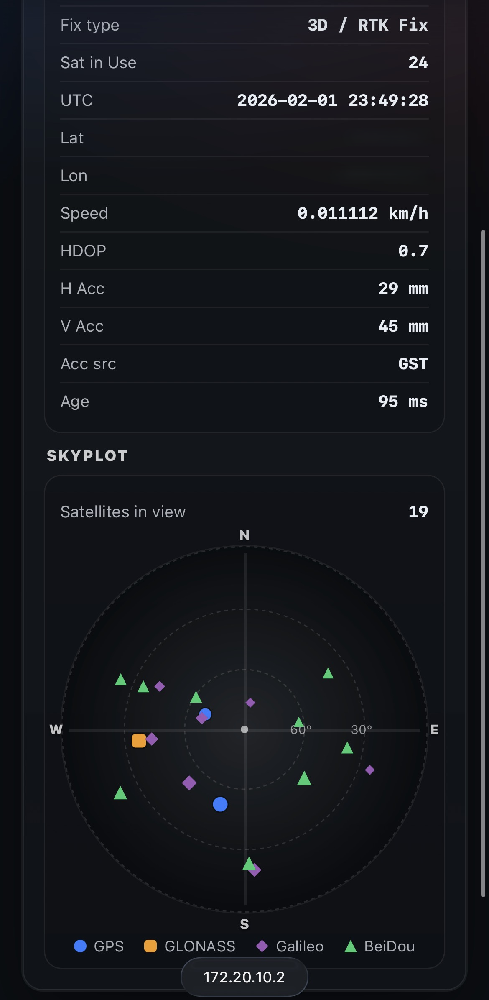
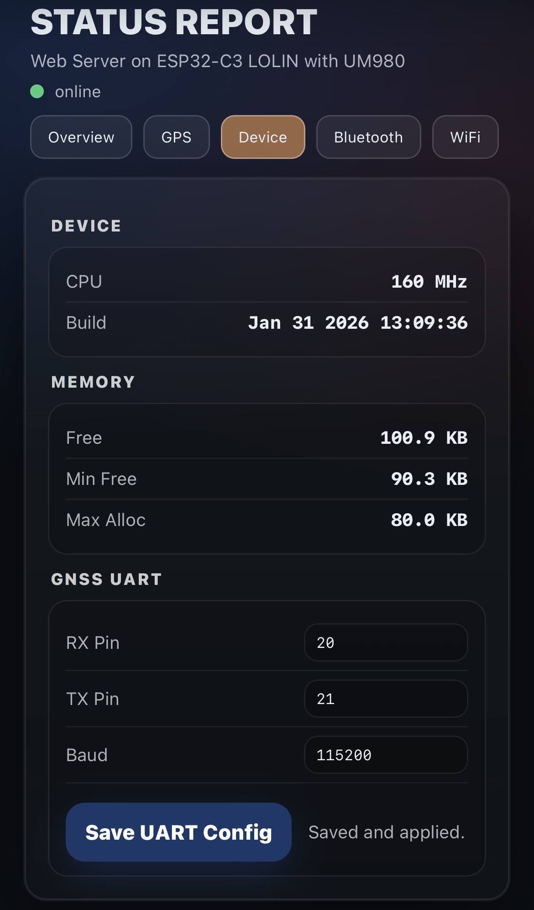

# GNSS Arduino Project

ESP32 firmware acting as a transparent GNSS bridge (UART ↔ BLE ↔ TCP) with optional Web UI configuration.

## 🚀 Installation

This project is built with **PlatformIO** and targets **ESP32** boards.

You can either **build from source** or **flash a prebuilt binary** (recommended).

---

### Flash the provided bin and use LittleFS Uploader

1. **Get the firmware bin**  
   - Download a prebuilt `.bin` (in the release section), **or** rebuild with PlatformIO:
     ```bash
     pio run
     ```

2. **Flash**
   - Use your favorite tool (I use platformio or esptool)

3. **Prepare your JSON files**  
   - Create/modify (you will find example in /data):
     - `utils/data/gnss.json`
     - `utils/data/wifi.json`

4. **Upload**  
   - Run the GUI tool:
     - `utils/littlefs_uploaderGUI.py`
   - Select your COM port and upload the generated LittleFS image to the ESP32. Read the instruction for the dependencies

After upload, reboot the device and the Web UI will show the new values.


### Build & Flash from Source

#### Prerequisites
- VS Code with **PlatformIO** extension  
  **or**
- PlatformIO Core (CLI)
- USB cable
- ESP32 board

#### Clone and Upload
```bash
git clone https://github.com/entr0-pi/gnss.git
cd gnss
pio run -t upload
```

#### WiFi Configuration (Optional)
If WiFi is enabled (`WEBUI_ENABLE=1` or `TCP_ENABLE=1`), you have two options:

1) **Web UI (runtime)**  
   - Edit SSID/password (and DHCP/static IP) in the **WiFi tab**  
   - Saved to `/wifi.json` in LittleFS  
   - Device restarts and applies changes automatically

2) **Compile-time secrets (locked)**  
   ```bash
   cp include/secrets.example.h include/secrets.h
   ```
   Edit `include/secrets.h`, then rebuild.  
   To force secrets and skip LittleFS WiFi config, add:
   ```
   -DFORCE_WIFI_SECRETS=1
   ```
   to `platformio.ini` build flags.

PlatformIO automatically installs dependencies, builds the firmware, and flashes the board.


---

## Quick Configuration Paths

### Runtime Configuration (Default)
- Configure GNSS UART via Web UI
- Settings stored in LittleFS
- Persists across reboots and firmware updates

### WiFi + UART via Web UI (LittleFS)
You can change GNSS pins/baud and WiFi credentials directly in the Web UI:
- UART config saves to `/gnss.json`
- WiFi config saves to `/wifi.json`
- After clicking **Save**, the device restarts and applies the new settings

If you want to pre-load these settings (before first boot or after a flash erase),
upload the LittleFS image using the GUI tool as described above.

### Production / Fixed Hardware
Hardcode UART pins at compile time:
```ini
build_flags =
  -DFORCE_HARDCODED_UART=1
  -DHARD_RX_PIN=20
  -DHARD_TX_PIN=21
  -DHARD_BAUD=115200
```

- Configuration locked
- Web UI becomes read-only
- No filesystem dependency

---

## Build Flags (Quick Reference)

| Flag | Default | Description |
|---|---|---|
| `WEBUI_ENABLE` | `0` | Enable WiFi + Web UI (required for NTRIP) |
| `NMEA_ENABLE` | `0` | Enable optional NMEA parser |
| `TCP_ENABLE` | `0` | Enable TCP server |
| `NTRIP_CLIENT_ENABLE` | `0` | Enable NTRIP client (requires Web UI + WiFi) |
| `WIFI_ENABLE` | auto | Enabled if Web UI, TCP, or NTRIP is enabled |
| `TCP_PORT` | `5000` | TCP server port |
| `BLE_DEVICE_NAME` | `GNSS-BLE` | BLE advertising name |
| `BLE_MTU_CFG` | `23` | Requested BLE MTU |
| `GNSS_HZ_CFG` | `1` | GNSS output rate (Hz) |
| `BLE_ENABLE` | `0` | Enable BLE (NimBLE/NUS) support |
| `FORCE_WIFI_SECRETS` | `0` | Force WiFi credentials from `include/secrets.h` (skip `/wifi.json`) |
| `FORCE_HARDCODED_UART` | `0` | Lock UART config to compile-time pins/baud (skip `/gnss.json`) |
| `HARD_RX_PIN` | none | Required when `FORCE_HARDCODED_UART=1` |
| `HARD_TX_PIN` | none | Required when `FORCE_HARDCODED_UART=1` |
| `HARD_BAUD` | none | Required when `FORCE_HARDCODED_UART=1` |

Full list: see `include/README.md` and `include/app.h`.

---

## Folder Structure
```
.
├─ include/        # Headers, config, generated web assets
├─ lib/            # Reusable libraries
├─ scripts/        # Build & tooling scripts
├─ src/            # Firmware source
├─ web/            # Web UI sources
├─ platformio.ini  # PlatformIO configuration
└─ README.md
```

---

## Web UI Assets
When `WEBUI_ENABLE=1`:
- `scripts/gzip_web.py` compresses `web/*`
- Generated headers are embedded in firmware

After editing Web UI files:
```bash
pio run -t upload
```

---

## Notes
- BLE and WiFi require **WiFi modem sleep enabled** on ESP32
- Firmware is a **raw byte-stream bridge**
- BLE uses Nordic UART Service (NUS)
- TCP mirrors the BLE stream (single client)

---

See below for detailed architecture, UART configuration system, BLE/TCP flow, production deployment examples, and troubleshooting.


# FULL DETAIL

## Overview
- Provide a clean PlatformIO-based firmware workspace for the GNSS device.
- Separate hardware-facing firmware from web assets and supporting scripts.
- Keep build, upload, and extension workflows simple.

## Features
- **PlatformIO configuration** with a single entry point in `platformio.ini`.
- **Firmware source layout** under `src/` and `include/` following PlatformIO conventions.
- **Shared libraries** kept in `lib/` for reusable components.
- **Web assets** stored in `web/` for any UI or hosted files.
- **Utility scripts** in `scripts/` for automation or tooling.
- **TCP server** (single-client) that mirrors the BLE byte stream.
- **NTRIP client integration** with JSON configuration (`/ntrip_config.json`), task-based lifecycle, and internet-reachability gating.
- **GNSS skyplot rendering using stereographic projection** for a readable satellite view that preserves angular relationships near the horizon.
- **Build-flag validation environment** via `platformio.ini` (`[env:full]`) to quickly test feature combinations (Web UI + NMEA + TCP + NTRIP) in one command.

## Build and Configuration
### Build Flags
- `WEBUI_ENABLE` (default `0`): enables WiFi/WebServer status UI. When `0`, web UI code is excluded and `scripts/gzip_web.py` does not run.
- `NMEA_ENABLE` (default `0`): enables the optional NMEA parser. When `WEBUI_ENABLE=0`, NMEA is forced off at build time. To get the full WebUI, your GNSS needs to send at minimum: GGA, GSV, GSA, GST and RMC.
- `TCP_ENABLE` (default `0`): enables the TCP server that mirrors the BLE stream.
- `NTRIP_CLIENT_ENABLE` (default `0`): enables the NTRIP client and JSON configuration in LittleFS (`/ntrip_config.json`). Requires `WEBUI_ENABLE=1` so the internet-reachability probe is available.
- `WIFI_ENABLE` (default `WEBUI_ENABLE || TCP_ENABLE || NTRIP_CLIENT_ENABLE`): enables WiFi STA (required for web UI, TCP, or NTRIP).
- `TCP_PORT` (default `5000`): TCP port for the single-client server.
- `BLE_DEVICE_NAME` (default `"GNSS-BLE"`): BLE advertising name override.
- `BLE_MTU_CFG` (default `23`): requested BLE MTU; if negotiated MTU is valid (>=23) it is used at runtime, otherwise this value is the fallback; used to derive max notify payload.
- `GNSS_HZ_CFG` (default `1`): GNSS output rate (Hz) used for low-rate throttling.
- `BLE_ENABLE` (default `0`): enable BLE (NimBLE/NUS) support.
- `FORCE_WIFI_SECRETS` (default `0`): force WiFi credentials from `include/secrets.h` and skip `/wifi.json`.
- `FORCE_HARDCODED_UART` (default `0`): lock UART config to compile-time pins/baud (requires `HARD_RX_PIN`, `HARD_TX_PIN`, `HARD_BAUD`).
- Full parameter list: see `include/README.md` and `include/app.h`.
- WiFi credentials: configure via Web UI (saved to `/wifi.json`) or copy `include/secrets.example.h` to `include/secrets.h` (gitignored) and enable `FORCE_WIFI_SECRETS`.

### Build Flag Tester (Feature Matrix Smoke Test)
Use the provided full-feature environment as a quick build sanity check:

```bash
pio run -e full
```

This environment enables `WEBUI_ENABLE`, `NMEA_ENABLE`, `TCP_ENABLE`, and `NTRIP_CLIENT_ENABLE` together to validate that the main optional modules still build cleanly when combined.

### BLE MTU and Throttling
- `BLE_MTU_CFG` in `include/app.h` is used to derive the max notify payload (`BLE_MAX_PAYLOAD = BLE_MTU - 3`).
- `BLE_NOTIFY_CHUNK` is tied to `BLE_MAX_PAYLOAD` to avoid oversize notifications.
- Low-rate throttling is derived from MTU and GNSS rate:
  - `BLE_LOW_RATE_THRESHOLD = BLE_MAX_PAYLOAD / 2`
  - `BLE_LOW_RATE_DELAY_MS = min(1000 / (4 * GNSS_HZ), 100)`

Full parameter list: see `include/README` and `include/app.h`.

### WiFi + BLE Coexistence Warning
- When `WEBUI_ENABLE=1` and BLE is enabled, **WiFi modem sleep must be enabled**.
- If `WiFi.setSleep(false)` is used, the ESP32 can abort with:
  `Error! Should enable WiFi modem sleep when both WiFi and Bluetooth are enabled!!!!!!`

### Web UI Assets
- When `WEBUI_ENABLE=1`, the build runs `scripts/gzip_web.py` to regenerate `include/app_*.h` from `web/*`.
- After editing `web/index.html`, `web/app.js`, or `web/style.css`, rebuild so the headers are refreshed.

### Flash From BIN (Espressif Flash Download Tool)
You can flash prebuilt `.bin` files directly using Espressif's Flash Download Tool (Windows GUI).

Key parameters in the tool:
- `ChipType`: select the chip type for your device.
- `WorkMode`: `Develop` and `LoadMode=UART`.
- `Download Path Config`: select the `.bin` file and set the flash address.
- `SPI SPEED` / `SPI MODE`: SPI flash parameters.
- `COM` / `BAUD`: serial port and baud rate.
- `START`: start flashing.

For this project (PlatformIO `lolin_c3_mini` / ESP32), I use these offsets in `Download Path Config`:
- `bootloader.bin` at `0x1000`
- `partitions.bin` at `0x8000`
- `firmware.bin` (factory app) at `0x10000`

Typical steps:
1. Put the device into download mode (board-specific).
2. Open the tool, set `ChipType`, `WorkMode`, `LoadMode=UART`, and add each `.bin` + address.
3. Set `COM` and `BAUD`, then click `START`.

Note: offsets can change with custom partition tables. If you use a custom partition CSV, flash the app at the offset shown in that table.

## UART Configuration System

The firmware supports flexible UART pin and baud rate configuration through a three-tier system: **Build Flags**, **LittleFS Persistent Storage**, and **Fallback Defaults**. This allows both development flexibility (runtime configuration via web UI) and production reliability (compile-time hardcoded values).

### Configuration Tiers (Priority Order)

#### Tier 1: Build Flags (Highest Priority)
Override all runtime configuration by defining pins at compile time:

```ini
# In platformio.ini:
build_flags =
  -DFORCE_HARDCODED_UART=1
  -DHARD_RX_PIN=20
  -DHARD_TX_PIN=21
  -DHARD_BAUD=115200
```

**When to use:**
- Production firmware with known hardware
- Embedded systems where configuration must not change
- Faster boot time (no filesystem I/O)
- Maximum reliability (no dependency on LittleFS)

**Behavior:**
- UART pins/baud are compiled into firmware
- LittleFS config is ignored
- Web UI displays current config but cannot change it
- Requires recompilation to modify

#### Tier 2: LittleFS Config (Normal Priority, the provided bin)
Runtime configuration stored in `/gnss.json` on LittleFS partition:

```json
{
  "rx_pin": 20,
  "tx_pin": 21,
  "baud": 115200
}
```

**When to use:**
- Development and testing
- User-configurable devices
- Field-deployable systems where pin assignments vary
- Prototyping with different GNSS modules

**Behavior:**
- User configures via web UI
- Config persists across reboots and firmware updates
- Can be changed without recompilation
- Default mode (no build flags required)

#### Tier 3: Fallback Config (Lowest Priority)
Hardcoded safety values in `include/app.h`:

```cpp
FALLBACK_GNSS_RX   = 20
FALLBACK_GNSS_TX   = 21
FALLBACK_GNSS_BAUD = 9600
```

**When to use:**
- Automatic fallback when LittleFS fails/corrupts
- Emergency recovery mode
- First boot before user configuration

**Behavior:**
- Only activates if LittleFS mount fails completely
- Prevents total boot failure
- Allows recovery via web UI after boot

### Configuration Flow Diagram



### Default Behavior (Unconfigured State)

On first boot with no build flags:
- `PIN_GNSS_RX = -1` (unconfigured)
- `PIN_GNSS_TX = -1` (unconfigured)
- `GNSS_BAUD = 0` (unconfigured)

**Result:**
- UART initialization is **skipped**
- Device boots successfully
- Web UI is accessible
- User **must** configure pins via web UI before UART works

### Configuration via Web UI

1. **Access Web UI**: `http://<device-ip>`
2. **Navigate to Device Tab**: GNSS UART section
3. **Configuration Behavior**: The web UI automatically adapts based on build mode

#### Unlocked Mode (Runtime Configuration)
When `FORCE_HARDCODED_UART` is **not** defined in build flags:

- **Input Fields**: Editable (white background)
- **Save Button**: Visible and functional
- **Status Message**: "Loaded from device"
- **Workflow**:
  1. Enter values:
     - RX Pin (ESP32 RX, connects to GNSS TX): `0-21` (ESP32)
     - TX Pin (ESP32 TX, connects to GNSS RX): `0-21` (ESP32)
     - Baud Rate: `1200-2000000`
  2. Click "Save UART Config"
  3. Config persists to `/gnss.json` in LittleFS
  4. Device automatically restarts and applies new settings

#### Locked Mode (Compile-Time Configuration)
When `FORCE_HARDCODED_UART=1` is defined in build flags:

- **Input Fields**: Read-only (greyed out, darker background)
- **Save Button**: Hidden
- **Status Message**: "🔒 Configuration locked (compile-time flags)"
- **Behavior**:
  - Displays current hardcoded values from build flags
  - Values cannot be modified via web UI
  - Any attempt to POST config changes returns HTTP 403 error
  - To change: modify `platformio.ini` build flags and rebuild firmware

**Visual Indicators:**
- Locked inputs have darker background and "not-allowed" cursor
- Lock emoji (🔒) clearly indicates read-only state
- Users cannot accidentally attempt to save locked configuration

### LittleFS Partition Details

- **Partition Name**: `spiffs` (LittleFS uses SPIFFS partition type)
- **Partition SubType**: `spiffs` (compatible with LittleFS driver)
- **Size**: 64KB (`0x10000`)
- **Location**: See `partitions.csv` (it has been configured for a 4MB ESP32 - change at your own risk)
- **Filesystem**: LittleFS (configured via `board_build.filesystem = littlefs`)

**File Structure:**
```
/gnss.json    # UART configuration (rx_pin, tx_pin, baud)
/wifi.json    # WiFi configuration (ssid, pass, dhcp, ip, gw, subnet, dns)
```

### Validation Rules

| Parameter | Unconfigured | Valid Range | Notes |
|-----------|-------------|-------------|-------|
| `rx_pin` | `-1` | `0-21` | ESP32 GPIO range |
| `tx_pin` | `-1` | `0-21` | Must differ from rx_pin |
| `baud` | `0` | `1200-2000000` | Common: 9600, 115200 |

**Special Values:**
- `-1` (pins) or `0` (baud) = Unconfigured → UART skipped
- Allows explicit "not configured" state vs. invalid values

### Production Deployment Examples

#### Example 1: Fixed Hardware (Recommended for Production)
```ini
# platformio.ini
[env:production]
build_flags =
  ${env.build_flags}
  -DFORCE_HARDCODED_UART=1
  -DHARD_RX_PIN=4
  -DHARD_TX_PIN=5
  -DHARD_BAUD=9600
```

**Result:**
- Pins hardcoded to GPIO4/5 @ 9600 baud
- No LittleFS dependency for UART config
- Faster boot, more reliable
- **Web UI**: Displays locked config (read-only fields, no save button)

#### Example 2: Multi-Variant Hardware
```ini
[env:variant_a]
build_flags =
  -DFORCE_HARDCODED_UART=1
  -DHARD_RX_PIN=20
  -DHARD_TX_PIN=21
  -DHARD_BAUD=115200

[env:variant_b]
build_flags =
  -DFORCE_HARDCODED_UART=1
  -DHARD_RX_PIN=4
  -DHARD_TX_PIN=5
  -DHARD_BAUD=9600
```

**Result:**
- Same codebase, different builds
- Each variant has fixed pins
- No runtime configuration needed
- **Web UI**: Each variant shows its locked values

#### Example 3: User-Configurable (Default, this bin)
```ini
# No FORCE_HARDCODED_UART flags
build_flags =
  -DBLE_DEVICE_NAME=\"MyGNSS\"
```

**Result:**
- User configures pins via web UI
- Config stored in LittleFS
- Flexible for field deployment
- Survives firmware updates
- **Web UI**: Editable fields with save button

### Troubleshooting

#### Problem: Device won't boot / resets continuously
**Cause:** UART pins causing hardware hang (ESP32 known issue with certain pins)

**Solution 1 - Factory Reset:**
1. Erase flash: `pio run -t erase`
2. Re-upload firmware
3. Configure different pins via web UI

**Solution 2 - Use Fallback:**
1. Corrupt/delete LittleFS (flash erase)
2. Device boots with fallback pins (20/21)
3. Access web UI to reconfigure

#### Problem: LittleFS mount fails
**Error:** `[GNSS] LittleFS mount failed after format!`

**Automatic Recovery:**
- Firmware uses fallback config (20/21/9600)
- Device boots with UART active
- Web UI accessible (if WiFi works)

**Manual Recovery:**
```bash
# Erase and re-flash
pio run -t erase
pio run -t upload
```

#### Problem: Config changes don't persist
**Check:**
1. LittleFS mounted? Look for `[GNSS] LittleFS mounted successfully`
2. Save successful? Look for `[GNSS] Config loaded from file`
3. Partition table correct? Check `partitions.csv`

#### Problem: Want to reset to unconfigured state
**Options:**

1. **Via Web UI:** Set all values to `-1` (RX), `-1` (TX), `0` (baud)
2. **Delete config file:** Flash erase or delete `/gnss.json`
3. **Factory reset:** Erase flash, re-upload

#### Problem: Cannot change UART config in web UI
**Symptom:** Input fields are greyed out, save button is hidden, lock icon displayed

**Cause:** Configuration is locked via `FORCE_HARDCODED_UART` build flag

**Solution:**
1. Open `platformio.ini`
2. Comment out or remove these lines:
   ```ini
   -DFORCE_HARDCODED_UART=1
   -DHARD_RX_PIN=20
   -DHARD_TX_PIN=21
   -DHARD_BAUD=115200
   ```
3. Rebuild and upload firmware: `pio run -t upload`
4. Web UI will now show editable fields

**Note:** This is intentional for production builds to prevent accidental configuration changes.

### File References

- Configuration struct: `include/gnss_config.h`
- LittleFS implementation: `src/gnss_config.cpp`
- Default values: `include/app.h` (lines 79-109)
- Partition table: `partitions.csv`
- Build configuration: `platformio.ini`
- Web UI backend (API endpoints): `src/web_ui.cpp` (lines 422-491)
- Web UI frontend (locked state handling): `web/app.js` (lines 77-116)
- Web UI styling (readonly inputs): `web/style.css` (lines 119-124)

## UART, BLE, and Buffer Flow
The ESP32 firmware acts as a transparent byte-stream bridge between the GNSS UART and a BLE client (phone/tablet). It uses the Nordic UART Service (NUS) for BLE and FreeRTOS StreamBuffers as ring buffers to decouple producer/consumer timing.

### Data Transit Flow Graph


### UART (ESP32 <-> GNSS)
- **Pins:** Configurable via web UI or build flags (see [UART Configuration System](#uart-configuration-system)).
  - Default: Unconfigured (`-1/-1`) - must be set by user
  - Fallback: GPIO20 (RX) / GPIO21 (TX) if LittleFS fails
  - Production: Set via `HARD_RX_PIN`/`HARD_TX_PIN` build flags
- **Baud:** Configurable (`1200-2000000`), default unconfigured (`0`).
- **Payload:** Raw GNSS output (NMEA and any other serial bytes). There is no framing or parsing required for the pass-through path.

### BLE (ESP32 -> Client)
- **Service:** Nordic UART Service (NUS).
- **Characteristics:**
  - **RX (phone -> ESP32):** WRITE/WRITE_NR, used for RTCM or other inbound bytes.
  - **TX (ESP32 -> phone):** NOTIFY, used to stream GNSS output to the client.
- **MTU:** Requested MTU is 23 in `include/app.h` (adjust to match your phone/app behavior).

### TCP (ESP32 -> Client)
- **Server:** Single-client TCP server (`WiFiServer`) on `TCP_PORT`.
- **Direction:** Same raw byte stream as BLE (NMEA + any other GNSS serial bytes).
- **Inbound:** TCP bytes are forwarded to GNSS UART (RTCM or other binary payloads).

### Stream Buffers (Decoupling and Backpressure)
The firmware uses FreeRTOS StreamBuffers (ring buffers) to handle bursty traffic and to avoid blocking BLE/UART tasks:

1. **UART -> BLE buffer**
   - **Purpose:** Stores bytes read from the GNSS UART until the BLE notify task can send them.
   - **Size:** 4096 bytes (tuned for continuous NMEA output).
   - **Flow:** UART RX task pushes bytes -> BLE TX task pulls bytes -> BLE notifications.

2. **BLE -> UART buffer**
   - **Purpose:** Stores bytes written by the client (typically RTCM corrections) until the UART TX task can forward them.
   - **Size:** 16384 bytes (larger to handle spiky RTCM bursts).
   - **Flow:** BLE write callback pushes bytes -> UART TX task pulls bytes -> GNSS UART.

3. **UART -> TCP buffer**
   - **Purpose:** Stores bytes read from the GNSS UART until the TCP task can send them.
   - **Size:** 2048 bytes (same stream as BLE, smaller footprint).
   - **Flow:** UART RX task pushes bytes -> TCP task pulls bytes -> TCP socket.

4. **TCP -> UART buffer**
   - **Purpose:** Stores bytes written by the TCP client until the UART TX task can forward them.
   - **Size:** 4096 bytes.
   - **Flow:** TCP task pushes bytes -> UART TX task pulls bytes -> GNSS UART.

### Backpressure and Drops
- BLE notifications are **paced** to avoid overloading the BLE stack.
- TCP writes are **best-effort**; if a buffer fills or the socket can't accept data, bytes are dropped.
- If a buffer fills, new bytes are **dropped** (best-effort). Drop counters are exposed in the UI.
- The BLE/TCP TX tasks will **not drain** the UART buffers when the client is disconnected, so the client sees the most current data when it reconnects.

### Drops Tuning (when UI shows drops)
- **UART->BLE drops**: increase `SB_UART_TO_BLE_SIZE` or reduce BLE send rate (increase `BLE_TX_WAIT_TICKS` / `BLE_LOW_RATE_DELAY_MS`).
- **BLE->UART drops**: increase `SB_BLE_TO_UART_SIZE` or lower burst size on the phone/app side.
- **UART->TCP drops**: increase `SB_UART_TO_TCP_SIZE` or lower TCP client read latency.
- **TCP->UART drops**: increase `SB_TCP_TO_UART_SIZE` or lower burst size on the TCP client side.
- **Large MTU**: if your phone supports it, raise `BLE_MTU_CFG` to increase per-notify payload (rebuild required).
- After tuning, rebuild so the new constants take effect.


## Folder Structure
```
.
|- include/        # Header files and shared declarations
|- lib/            # Reusable libraries
|- scripts/        # Build or development helper scripts
|- src/            # Firmware source files (main entry points)
|- web/            # Web UI or static assets. Render locally with scripts/render_web.py (fake data in status.json)
|- platformio.ini  # PlatformIO project configuration
`- README.md       # Project documentation
```

## Scripts
- `scripts/gzip_web.py`: Gzips `web/*` assets and emits `include/app_*.h` PROGMEM headers (skips when `WEBUI_ENABLE=0`).
- `scripts/render_web.py`: Simple FastAPI dev server to serve `web/` and mock `/api/status` + `/api/restart`.

## Additional Information
- Build and upload with PlatformIO using the standard `pio run` and `pio run -t upload` commands.
- When adding new code, prefer keeping device logic in `src/` and generic helpers in `lib/`.
- If you add a frontend, keep assets in `web/` and document any build steps here.
- Example clients: BLE apps like SW Maps; TCP clients like QField.

## Web UI Screenshot

<p align="center">
  
  
  \
  
  
  
</p>
