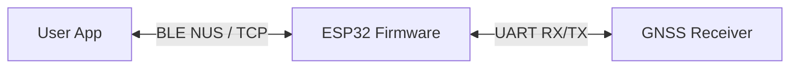
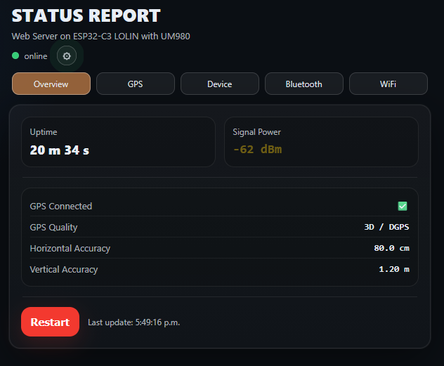
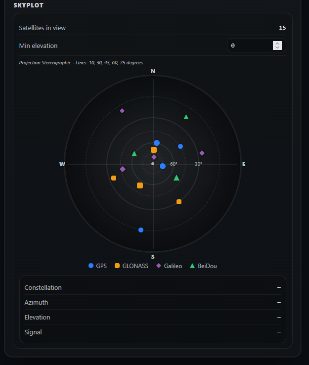

# GNSS ESP32 Bridge

ESP32 firmware that bridges a GNSS UART stream to wireless clients.

It can expose raw GNSS serial data over:
- BLE (Nordic UART Service) 🛰️
- TCP socket 🌐

Optional Web UI adds browser-based status and configuration (UART, WiFi, NTRIP) for flexible prototyping and locked production builds.

## Project Overview

This project is GNSS-agnostic firmware for ESP32 boards:
- GNSS input/output on `Serial1` (UART)
- Raw byte passthrough (NMEA and other serial payloads)
- Optional BLE NUS bridge
- Optional single-client TCP bridge
- Optional Web UI for config + monitoring
- Optional NTRIP client feeding corrections into GNSS UART

Design intent:
- Works with different GNSS modules and wiring
- Works across ESP32 variants supported by PlatformIO
- Supports runtime-configurable mode and compile-time locked mode

## QuickStart

### A) Flashing A Prebuilt Binary

Use this when you want the fastest bring-up without building locally.

What you need:
- A prebuilt binary set (`bootloader.bin`, `partitions.bin`, `firmware.bin`) matching your board/chip
- A flash tool (`esptool.py`, PlatformIO upload, or Espressif Flash Download Tool)

Typical offsets for this repo partition table:
- `bootloader.bin` -> `0x1000`
- `partitions.bin` -> `0x8000`
- `firmware.bin` -> `0x10000`

After flashing, the firmware immediately:
- boots,
- seeds NVS defaults when mutable,
- starts enabled features from build flags.

Important default behavior:
- UART defaults to unconfigured (`rx_pin=-1`, `tx_pin=-1`, `baud=0`) unless hardcoded at build time.
- In that unconfigured state, UART bridging is intentionally skipped until configured.

Preload NVS settings (recommended for field deployment):
- Use `utils/uploader/uploaderGUI.py` to write GNSS/WiFi/NTRIP values to NVS and flash LittleFS web assets.
- This avoids recompiling just to change target wiring or network values.

### B) Building From Source

Use this when you need to:
- change feature flags,
- target another ESP32 board,
- modify firmware behavior.

Prerequisites:
- PlatformIO (VS Code extension or CLI)

Commands:
```bash
pio run
pio run -t upload
```

Main project locations:
- `platformio.ini` (board + build flags)
- `src/` (firmware)
- `include/` (feature flags/config headers)
- `data/web/` (Web UI static files)

### C) Utils

Available tooling under `utils/`:
- `utils/uploader/uploaderGUI.py`: NVS editor + writer, LittleFS builder/flasher
- `utils/render-web/render_web.py`: local dev server for `data/web/` with mock API
- `utils/build-tester/build_Tester.py`: build matrix tester for feature flags
- `utils/build-tester/Dockerfile`: reproducible Docker runner for the build tester

## Architecture & Data Flow



Implemented data paths:
- GNSS -> ESP32 over UART: raw bytes read from `Serial1`
- ESP32 -> BLE client: buffered notifications (when BLE enabled and subscribed)
- BLE client -> ESP32 -> GNSS: writes forwarded to UART (useful for RTCM)
- ESP32 -> TCP client: mirrored raw stream via single TCP client server
- TCP client -> ESP32 -> GNSS: inbound TCP bytes forwarded to UART
- NTRIP client (optional): RTCM stream forwarded to UART

## GNSS & NMEA Requirements

Base bridge requirement:
- GNSS must output serial data on UART (NMEA typically)
- Firmware forwards raw bytes; it does not require vendor-specific protocol for passthrough

For Web UI satellite/fix panels (when `NMEA_ENABLE=1`):
- NMEA should be standard, checksum-valid sentences
- Parser currently consumes:
  - `RMC` (position/speed/date/time validity)
  - `GGA` (fix quality, sats used, HDOP)
  - `GSA` (fix type, HDOP)
  - `GST` (accuracy estimates)
  - `GSV` (satellites in view for skyplot/list)

If those sentences are missing, corresponding UI fields remain empty/stale.

## Customization (Core Value)

### A) Build-Time (compile-time flags)

Configure in `platformio.ini` / `include/app.h`:
- Feature toggles: `BLE_ENABLE`, `WEBUI_ENABLE`, `TCP_ENABLE`, `NMEA_ENABLE`, `NTRIP_CLIENT_ENABLE`
- Network mode: `WIFI_DUAL_MODE`, `SOFTAP_*`, `STA_CHANNEL`
- Locked production options:
  - `FORCE_HARDCODED_UART` + `HARD_RX_PIN/HARD_TX_PIN/HARD_BAUD`
  - `FORCE_WIFI_SECRETS` (+ `include/secrets.h`)

### B) At Rest (uploader / NVS preloading)

Write device config without recompiling:
- GNSS namespace: `rx_pin`, `tx_pin`, `baud`
- WiFi namespace: `ssid`, `pass`, `dhcp`, `ip`, `gw`, `subnet`, `dns`, `accesspoint`
- NTRIP namespace: caster + lockout fields

Use `utils/uploader/uploaderGUI.py` to manage and flash these values.

### C) Runtime (Web UI)

When `WEBUI_ENABLE=1`, HTTP API/UI can update:
- GNSS UART config (`/api/config`)
- WiFi config (`/api/wifi_config`)
- NTRIP config (`/api/ntrip_config`)

Mode behavior:
- Mutable mode: POST updates are accepted and persisted in NVS
- Locked mode: POST returns `403` when immutable flags are active

WiFi behavior supported by firmware:
- STA mode
- Optional STA+SoftAP dual mode (with NVS flag `wifi/accesspoint`)

## Build Flags Quick Reference

| Flag | Meaning |
|---|---|
| `BLE_ENABLE` | Enable BLE NUS bridge |
| `WEBUI_ENABLE` | Enable Web UI + HTTP API |
| `TCP_ENABLE` | Enable single-client TCP bridge |
| `NMEA_ENABLE` | Enable NMEA parsing for UI (forced off if Web UI off) |
| `NTRIP_CLIENT_ENABLE` | Enable NTRIP client (requires Web UI) |
| `TCP_PORT` | TCP listening port |
| `FORCE_HARDCODED_UART` | Lock UART to build-time pins/baud |
| `FORCE_WIFI_SECRETS` | Lock WiFi settings to `secrets.h` |
| `WIFI_DUAL_MODE` | Enable STA + SoftAP mode |

For the full parameter list and defaults, see `include/README.md` and `include/app.h`.

## Documentation References

For deeper technical details:
- `include/README.md`
- `include/app.h`
- `src/main.cpp`
- `src/web_ui.cpp`
- `src/nmea_gps.cpp`
- `src/gnss_config.cpp`
- `src/wifi_config.cpp`
- `src/ntrip_client.cpp`
- `utils/build-tester/README.md`

## Repository Layout

```text
.
├─ data/                 # LittleFS assets (web files, mock config/status)
├─ include/              # Config headers and module interfaces
├─ src/                  # Firmware implementation
├─ utils/uploader/       # NVS + LittleFS uploader GUI
├─ utils/render-web/     # Web UI local dev server
├─ utils/build-tester/   # Build matrix tester + Dockerfile
├─ partitions.csv
├─ platformio.ini
└─ README.md
```

## Some pictures...



