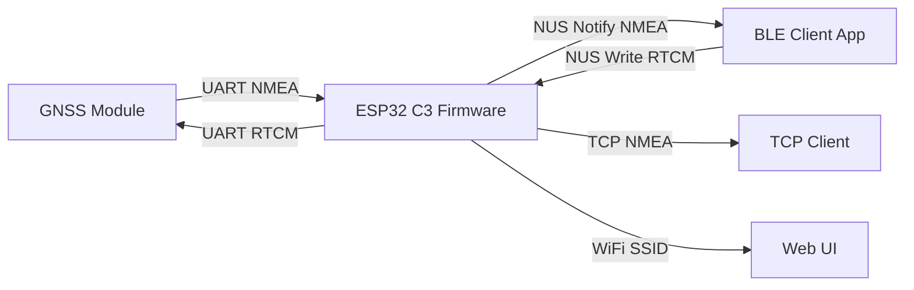
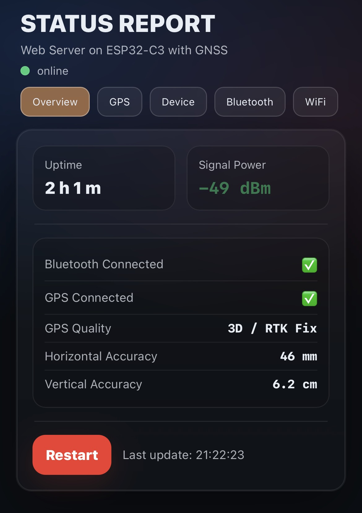
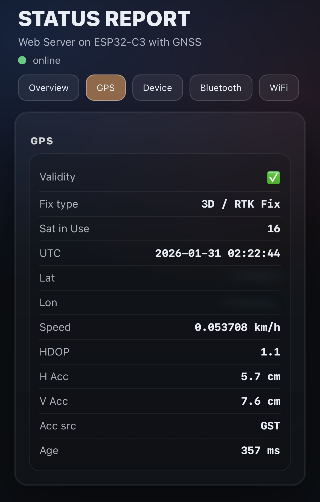
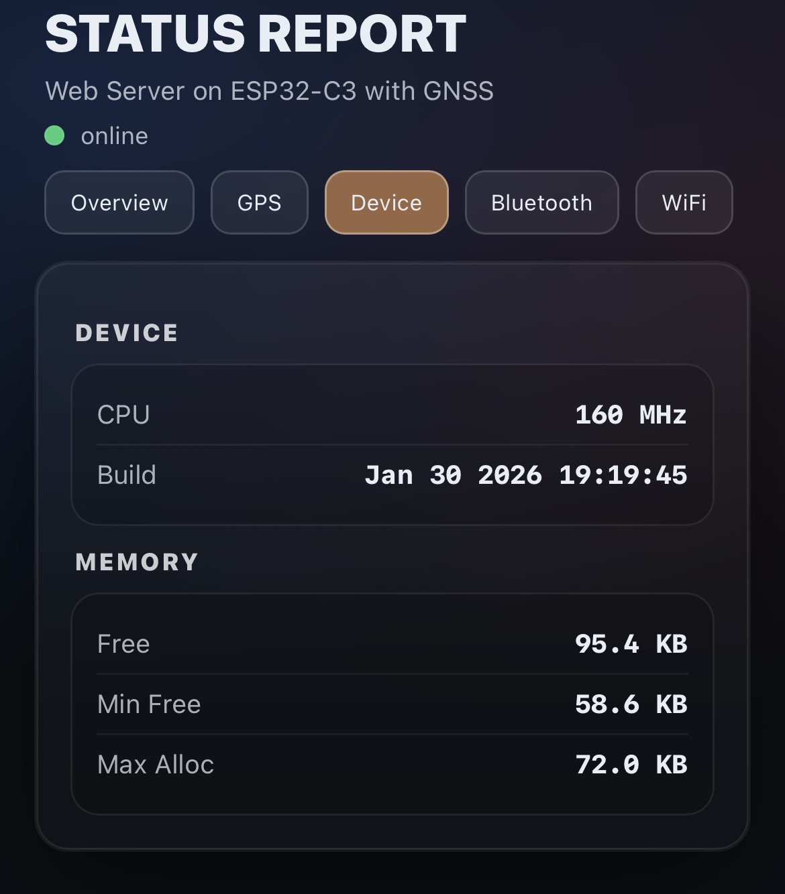
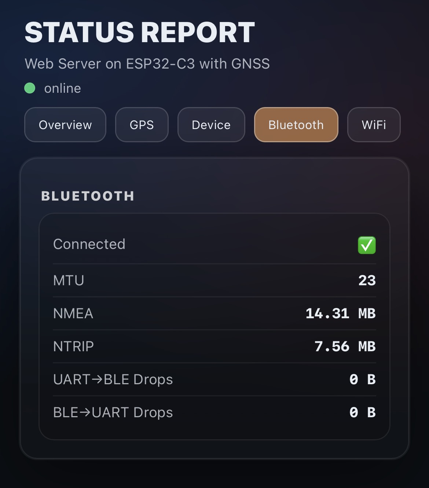
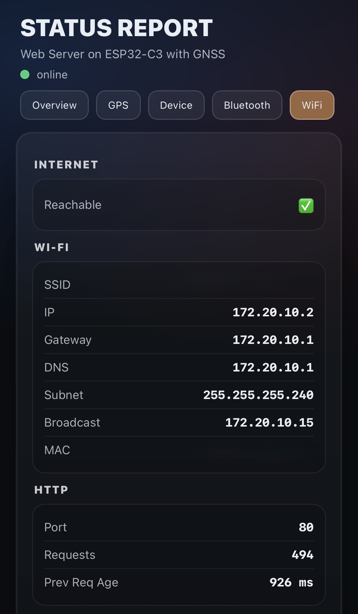

# GNSS Arduino Project

## Overview
- Provide a clean PlatformIO-based firmware workspace for the GNSS device.
- Separate hardware-facing firmware from web assets and supporting scripts.
- Keep build, upload, and extension workflows simple.

## Features
- **PlatformIO configuration** with a single entry point in `platformio.ini`.
- **Firmware source layout** under `src/` and `include/` following PlatformIO conventions.
- **Shared libraries** kept in `lib/` for reusable components.
- **Web assets** stored in `web/` for any UI or hosted files.
- **Utility scripts** in `scripts/` for automation or tooling.
- **TCP server** (single-client) that mirrors the BLE byte stream.

## Build and Configuration
### Build Flags
- `WEBUI_ENABLE` (default `1`): enables WiFi/WebServer status UI. When `0`, web UI code is excluded and `scripts/gzip_web.py` does not run.
- `NMEA_ENABLE` (default `0` unless set in an env): enables the optional NMEA parser. When `0`, bytes still stream over BLE but no parsing occurs.
- `TCP_ENABLE` (default `0`): enables the TCP server that mirrors the BLE stream.
- `WIFI_ENABLE` (default `WEBUI_ENABLE || TCP_ENABLE`): enables WiFi STA (required for web UI or TCP).
- `TCP_PORT` (default `5000`): TCP port for the single-client server.
- `BLE_DEVICE_NAME` (default `"GNSS-BLE"`): BLE advertising name override.
- `BLE_MTU_CFG` (default `23`): requested BLE MTU; if negotiated MTU is valid (>=23) it is used at runtime, otherwise this value is the fallback; used to derive max notify payload.
- `GNSS_HZ_CFG` (default `1`): GNSS output rate (Hz) used for low-rate throttling.
- Full parameter list: see `include/README.md` and `include/app.h`.
- WiFi credentials: copy `include/secrets.example.h` to `include/secrets.h` (gitignored).

### BLE MTU and Throttling
- `BLE_MTU_CFG` in `include/app.h` is used to derive the max notify payload (`BLE_MAX_PAYLOAD = BLE_MTU - 3`).
- `BLE_NOTIFY_CHUNK` is tied to `BLE_MAX_PAYLOAD` to avoid oversize notifications.
- Low-rate throttling is derived from MTU and GNSS rate:
  - `BLE_LOW_RATE_THRESHOLD = BLE_MAX_PAYLOAD / 2`
  - `BLE_LOW_RATE_DELAY_MS = min(1000 / (4 * GNSS_HZ), 100)`

Full parameter list: see `include/README` and `include/app.h`.

### WiFi + BLE Coexistence Warning
- When `WEBUI_ENABLE=1` and BLE is enabled, **WiFi modem sleep must be enabled**.
- If `WiFi.setSleep(false)` is used, the ESP32-C3 can abort with:
  `Error! Should enable WiFi modem sleep when both WiFi and Bluetooth are enabled!!!!!!`

### Web UI Assets
- When `WEBUI_ENABLE=1`, the build runs `scripts/gzip_web.py` to regenerate `include/app_*.h` from `web/*`.
- After editing `web/index.html`, `web/app.js`, or `web/style.css`, rebuild so the headers are refreshed.

### Flash From BIN (Espressif Flash Download Tool)
You can flash prebuilt `.bin` files directly using Espressif's Flash Download Tool (Windows GUI).

Key parameters in the tool:
- `ChipType`: select the chip type for your device.
- `WorkMode`: `Develop` and `LoadMode=UART`.
- `Download Path Config`: select the `.bin` file and set the flash address.
- `SPI SPEED` / `SPI MODE`: SPI flash parameters.
- `COM` / `BAUD`: serial port and baud rate.
- `START`: start flashing.

For this project (PlatformIO `lolin_c3_mini` / ESP32-C3), I use these offsets in `Download Path Config`:
- `bootloader.bin` at `0x1000`
- `partitions.bin` at `0x8000`
- `firmware.bin` (factory app) at `0x10000`

Typical steps:
1. Put the device into download mode (board-specific).
2. Open the tool, set `ChipType`, `WorkMode`, `LoadMode=UART`, and add each `.bin` + address.
3. Set `COM` and `BAUD`, then click `START`.

Note: offsets can change with custom partition tables. If you use a custom partition CSV, flash the app at the offset shown in that table.

### Proposed Build Matrix Script
Use `scripts/build_matrix.py` as a proposal for automating PlatformIO environment builds.
It lists a small matrix of flag-driven configurations and can either print or execute the
corresponding `pio run -e <env>` commands.

Preview the matrix without building:
```
python3 scripts/build_matrix.py
```

Execute the builds:
```
python3 scripts/build_matrix.py --execute
```

Limit to specific environments:
```
python3 scripts/build_matrix.py --execute --env nmea --env tcp_off
```

The matrix entries in the script cover the same flags documented above and are intended
as a starting point for CI or local automation.

## UART, BLE, and Buffer Flow
The ESP32-C3 firmware acts as a transparent byte-stream bridge between the GNSS UART and a BLE client (phone/tablet). It uses the Nordic UART Service (NUS) for BLE and FreeRTOS StreamBuffers as ring buffers to decouple producer/consumer timing.

### Data Transit Flow Graph


### UART (ESP32 <-> GNSS)
- **Pins:** ESP32 GPIO20 = RX (connected to GNSS TX), GPIO21 = TX (connected to GNSS RX).
- **Baud:** 115200 (matches GNSS serial baud rate).
- **Payload:** Raw GNSS output (NMEA and any other serial bytes). There is no framing or parsing required for the pass-through path.

### BLE (ESP32 -> Client)
- **Service:** Nordic UART Service (NUS).
- **Characteristics:**
  - **RX (phone -> ESP32):** WRITE/WRITE_NR, used for RTCM or other inbound bytes.
  - **TX (ESP32 -> phone):** NOTIFY, used to stream GNSS output to the client.
- **MTU:** Requested MTU is 23 in `include/app.h` (adjust to match your phone/app behavior).

### TCP (ESP32 -> Client)
- **Server:** Single-client TCP server (`WiFiServer`) on `TCP_PORT`.
- **Direction:** Same raw byte stream as BLE (NMEA + any other GNSS serial bytes).
- **Inbound:** TCP bytes are forwarded to GNSS UART (RTCM or other binary payloads).

### Stream Buffers (Decoupling and Backpressure)
The firmware uses FreeRTOS StreamBuffers (ring buffers) to handle bursty traffic and to avoid blocking BLE/UART tasks:

1. **UART -> BLE buffer**
   - **Purpose:** Stores bytes read from the GNSS UART until the BLE notify task can send them.
   - **Size:** 4096 bytes (tuned for continuous NMEA output).
   - **Flow:** UART RX task pushes bytes -> BLE TX task pulls bytes -> BLE notifications.

2. **BLE -> UART buffer**
   - **Purpose:** Stores bytes written by the client (typically RTCM corrections) until the UART TX task can forward them.
   - **Size:** 16384 bytes (larger to handle spiky RTCM bursts).
   - **Flow:** BLE write callback pushes bytes -> UART TX task pulls bytes -> GNSS UART.

3. **UART -> TCP buffer**
   - **Purpose:** Stores bytes read from the GNSS UART until the TCP task can send them.
   - **Size:** 2048 bytes (same stream as BLE, smaller footprint).
   - **Flow:** UART RX task pushes bytes -> TCP task pulls bytes -> TCP socket.

4. **TCP -> UART buffer**
   - **Purpose:** Stores bytes written by the TCP client until the UART TX task can forward them.
   - **Size:** 4096 bytes.
   - **Flow:** TCP task pushes bytes -> UART TX task pulls bytes -> GNSS UART.

### Backpressure and Drops
- BLE notifications are **paced** to avoid overloading the BLE stack.
- TCP writes are **best-effort**; if a buffer fills or the socket can't accept data, bytes are dropped.
- If a buffer fills, new bytes are **dropped** (best-effort). Drop counters are exposed in the UI.
- The BLE/TCP TX tasks will **not drain** the UART buffers when the client is disconnected, so the client sees the most current data when it reconnects.

### Drops Tuning (when UI shows drops)
- **UART->BLE drops**: increase `SB_UART_TO_BLE_SIZE` or reduce BLE send rate (increase `BLE_TX_WAIT_TICKS` / `BLE_LOW_RATE_DELAY_MS`).
- **BLE->UART drops**: increase `SB_BLE_TO_UART_SIZE` or lower burst size on the phone/app side.
- **UART->TCP drops**: increase `SB_UART_TO_TCP_SIZE` or lower TCP client read latency.
- **TCP->UART drops**: increase `SB_TCP_TO_UART_SIZE` or lower burst size on the TCP client side.
- **Large MTU**: if your phone supports it, raise `BLE_MTU_CFG` to increase per-notify payload (rebuild required).
- After tuning, rebuild so the new constants take effect.


## Folder Structure
```
.
|- include/        # Header files and shared declarations
|- lib/            # Reusable libraries
|- scripts/        # Build or development helper scripts
|- src/            # Firmware source files (main entry points)
|- web/            # Web UI or static assets. Render locally with scripts/render_web.py (fake data in status.json)
|- platformio.ini  # PlatformIO project configuration
`- README.md       # Project documentation
```

## Scripts
- `scripts/gzip_web.py`: Gzips `web/*` assets and emits `include/app_*.h` PROGMEM headers (skips when `WEBUI_ENABLE=0`).
- `scripts/render_web.py`: Simple FastAPI dev server to serve `web/` and mock `/api/status` + `/api/restart`.

## Additional Information
- Build and upload with PlatformIO using the standard `pio run` and `pio run -t upload` commands.
- When adding new code, prefer keeping device logic in `src/` and generic helpers in `lib/`.
- If you add a frontend, keep assets in `web/` and document any build steps here.
- Example clients: BLE apps like SW Maps; TCP clients like QField.

## Web UI

<p align="center">
  
  
  
  
  
</p>
