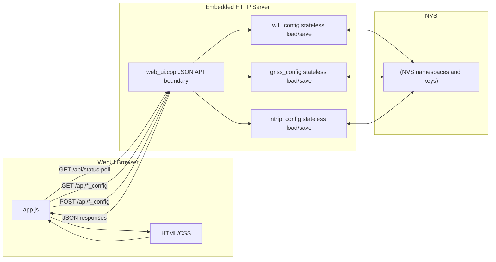
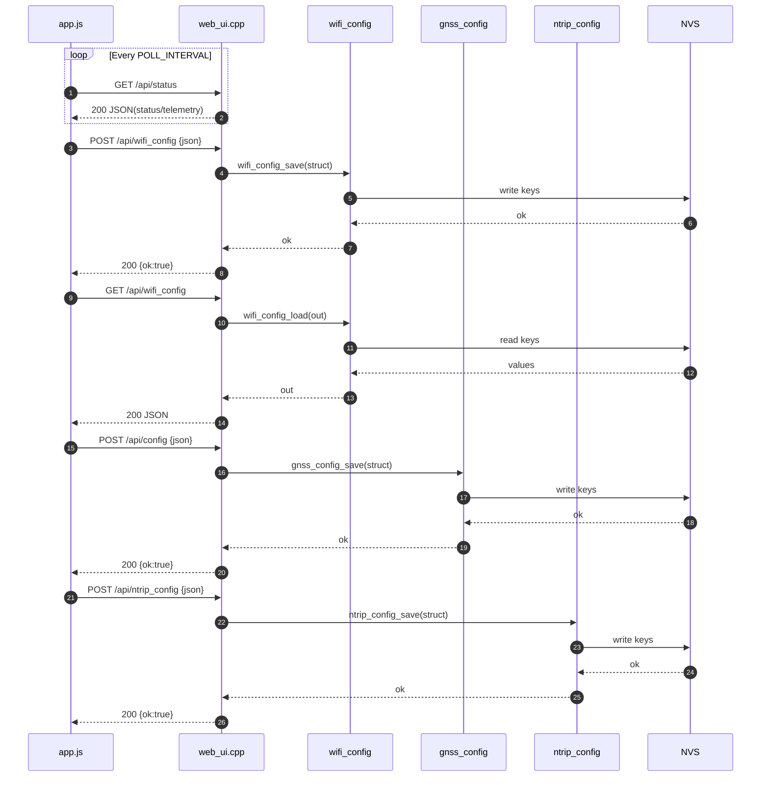

# Prompt for AI Agent — **Stateless** Config Modules (WiFi/GNSS/NTRIP) + `web_ui.cpp` as a Clean JSON Boundary

## What you are changing
Refactor the configuration stack so that **WiFi, GNSS, and NTRIP follow the exact same stateless pattern**:

- Each config domain has its own `*_config.cpp/.h` module.
- Each module is **stateless**: **every** `*_config_load()` reads from NVS on demand (no cached globals as the source of truth).
- `web_ui.cpp` becomes a **pure JSON boundary** (parse/validate JSON, call module load/save, return JSON). **No `Preferences` and no `nvs_keys::*` usage inside `web_ui.cpp` handlers.**

This aligns with the existing WiFi module style and makes GNSS and NTRIP consistent with it. (WiFi already loads/saves from NVS via `Preferences`.)

## Current state (relevant facts)
- `web_ui.cpp` currently implements **NTRIP** NVS reads/writes inline inside `handleNtripConfigGet/Post()` using `Preferences`. 
- `wifi_config.cpp` already encapsulates NVS read/write in `wifi_config_load/save()` under `nvs_keys::wifi::kNamespace`. 
- `gnss_config.cpp` is NVS-backed but currently maintains a cached `g_config` and returns it via `gnss_config_get()`. 

## Target state (non-negotiable rules)
1. **Stateless modules**: config values are loaded from NVS on demand using `*_config_load()`.
2. **NVS is source of truth**: all persisted config lives in NVS namespaces/keys.
3. **JSON is transport only**: JSON exists only at the HTTP boundary (request/response); do not store JSON blobs as server-side state.
4. **Clean boundary**: `web_ui.cpp` handlers do not touch NVS directly.
5. **No default value, hard coded**: the value is in NVS or not. No fallback hard-coded (can be from build flag if already there).

## Uniform module API (must be identical across WiFi/GNSS/NTRIP)
Each domain module must expose these functions (same naming, same semantics):

- `<Domain>Config <domain>_config_defaults();`
- `bool <domain>_config_validate(const <Domain>Config& cfg, String* error);`
- `bool <domain>_config_load(<Domain>Config& out, String* error);`
  - **Reads from NVS every call**.
  - Returns `true` only when required keys exist and values are valid.
- `bool <domain>_config_save(const <Domain>Config& in, String* error);`
  - Validates and writes to NVS.

> IMPORTANT: No module-global cached config (no `static g_config` that is returned to callers as the truth). If you keep an optional cache for performance, it must never replace NVS reads; `*_config_load()` must always read from NVS.

## Work items

### 1) Create `ntrip_config.h/.cpp` (NEW)
Move all NTRIP NVS logic out of `web_ui.cpp` and into a dedicated module.

**What to extract from `web_ui.cpp`:**
- All `Preferences prefs; prefs.begin(nvs_keys::ntrip::kNamespace, ...)` and all `prefs.isKey/get*/put*` calls in:
  - `handleNtripConfigGet()`
  - `handleNtripConfigPost()` 

**Data model:**
- `struct NtripConfig` with the fields already used in JSON + NVS:
  - enabled, host, port, mount, user, pass
  - max_tries, retry_delay_ms, health_timeout_ms, passive_sample_ms
  - required_valid_frames, buffer_size, connect_timeout_ms 

- `struct NtripLockout` with the lockout fields currently stored in NVS:
  - failed_attempts, abandoned, last_config_hash 

**Required API (stateless):**
- `NtripConfig ntrip_config_defaults();`
- `bool ntrip_config_validate(const NtripConfig& cfg, String* error);`
- `bool ntrip_config_load(NtripConfig& out, NtripLockout* lockoutOut, String* error);`
  - Reads **all** required keys from NVS every call.
- `bool ntrip_config_save(const NtripConfig& in, const NtripLockout* lockoutToPreserve, String* error);`
  - Writes config keys and preserves lockout (or writes lockout as passed).

### 2) Refactor GNSS to be stateless
Make GNSS follow the exact same load/save approach as WiFi.

- Implement `bool gnss_config_load(GnssConfig& out, String* error)` that reads from NVS **every time** using `Preferences`.
  - You already have NVS keys and logic in `load_config_nvs()`; expose it as the public `gnss_config_load()` (or call into it). 
- Implement `bool gnss_config_save(const GnssConfig& in, String* error)` that validates then writes to NVS.
  - Current `gnss_config_save(const GnssConfig&)` writes keys via `Preferences`; update signature to include `String* error` and unify error handling. 
- Remove or deprecate `gnss_config_get()` as a source-of-truth accessor.
  - If other code depends on it, change `gnss_config_get()` to internally call `gnss_config_load()` and return a static temporary (but still reading NVS each call).

Also simplify `gnss_config_begin()` so it does not depend on cached state. It may:
- ensure NVS is accessible,
- if missing keys: write defaults once,
- but **should not be the only time config is loaded**. 

### 3) Align WiFi with the same API surface
WiFi already has stateless `wifi_config_load/save()` with NVS `Preferences`. 

To match the uniform interface, add (if missing):
- `WifiConfig wifi_config_defaults();`
- `bool wifi_config_validate(const WifiConfig& cfg, String* error);`

Keep existing load/save behavior, just ensure validate/defaults semantics match the other modules.

### 4) Clean JSON boundary in `web_ui.cpp`
Update `web_ui.cpp` so config handlers **only**:
- parse JSON request bodies,
- validate required fields/types,
- convert into typed config structs,
- call module load/save,
- serialize JSON responses.

**Remove from handlers:**
- `Preferences` usage
- direct `nvs_keys::*` usage
- direct NVS key existence checks 

**Specific endpoint guidance (keep URLs and JSON shapes stable):**
- `GET /api/wifi_config` → `wifi_config_load()` → JSON response (mask pass as today).
- `POST /api/wifi_config` → parse JSON → `wifi_config_save()`.
- `GET /api/config` (GNSS) → `gnss_config_load()` + `gnss_config_defaults()` → JSON response.
- `POST /api/config` (GNSS) → parse JSON → validate → apply runtime change (if needed) → `gnss_config_save()`.
- `GET /api/ntrip_config` → `ntrip_config_load()` → JSON response.
- `POST /api/ntrip_config` → parse JSON → validate → `ntrip_config_save()`.

### 5) Preserve “JSON is transport only”
- JSON documents are local variables and serialized immediately.
- No global/static JSON objects.
- No “current config” JSON blob stored in RAM.

## Acceptance criteria
1. `web_ui.cpp` contains **no** direct `Preferences` usage and **no** direct `nvs_keys::*` access in handlers. 
2. `wifi_config`, `gnss_config`, `ntrip_config` all implement the same function set: defaults/validate/load/save.
3. Each `*_config_load()` reads from NVS on demand (stateless).
4. NTRIP NVS code is fully removed from `web_ui.cpp` and lives in `ntrip_config.cpp`. 
5. Existing endpoints and JSON fields remain backward-compatible (unless you update `app.js`).

## Quick regression tests
- Empty NVS boot:
  - WiFi load returns clear “not found” or defaults; do not crash. 
  - GNSS load returns “not found” or defaults; write defaults once if desired. 
  - NTRIP load returns “not found in NVS” equivalent message.
- Save each config via POST, reboot, verify GET returns persisted values.
- Send invalid JSON/missing fields; verify 400 with consistent error shape.

---

# Target-State Flow (Stateless Config Modules)

