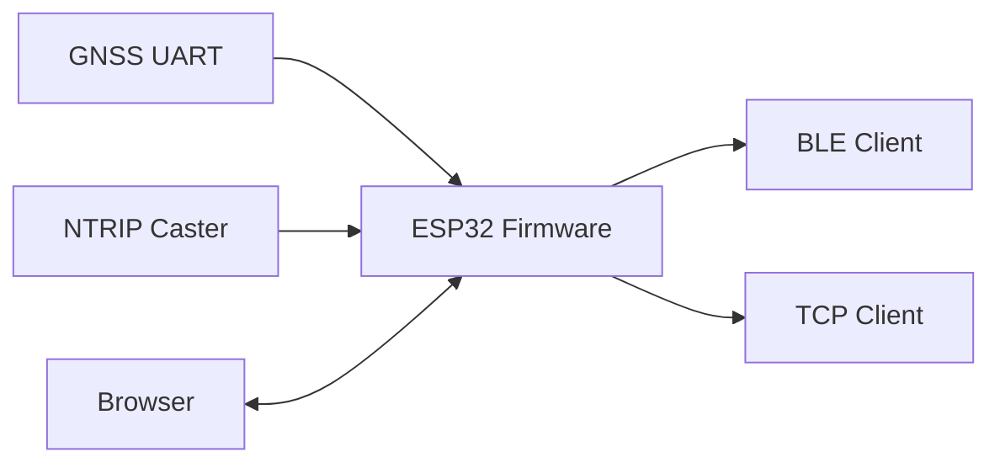
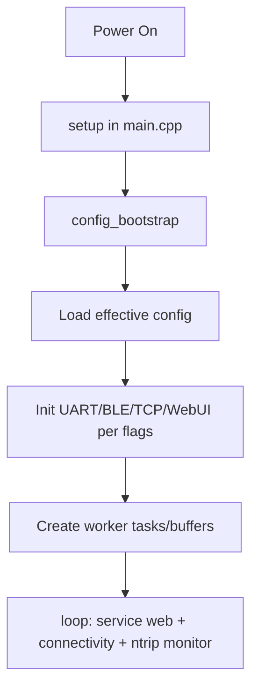
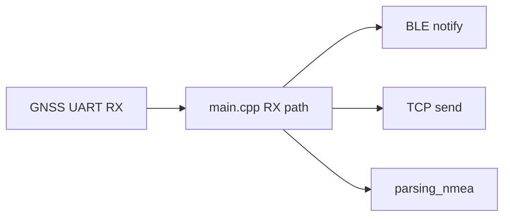
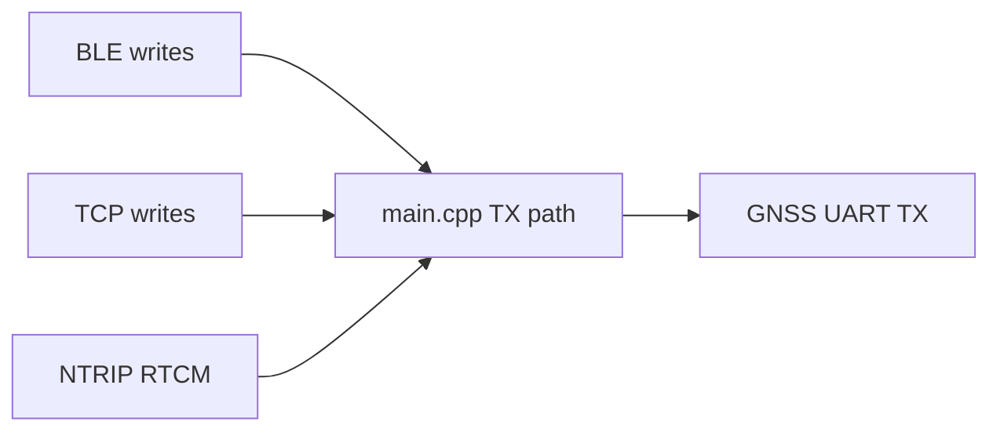

# GNSS ESP32 Architecture Guide

This document is a progressive guide to understand the codebase from user-visible behavior down to module internals.

## 1. Start Here: What the Firmware Does

The firmware runs on an ESP32 and bridges a GNSS UART stream to multiple clients:

- BLE (NUS)
- TCP socket
- Optional NTRIP corrections back to GNSS
- Optional Web UI (status + configuration)

High-level data flow:

## 2. Read Order (Recommended)

If you are new to the project, read in this sequence:

1. `platformio.ini` (build flags and enabled features)
2. `include/app.h` (default compile-time configuration)
3. `src/main.cpp` (boot, tasks, wiring of modules)
4. `src/web_ui.cpp` (HTTP API and UI serving)
5. `src/config_bootstrap.cpp` + `src/config_*.cpp` (NVS persistence)
6. `src/ntrip_client.cpp` (runtime NTRIP manager)
7. `src/parsing_nmea.cpp` (NMEA parsing for UI telemetry)

## 3. Runtime Architecture

Main modules and responsibilities:

- `src/main.cpp`
- Owns setup/loop lifecycle
- Creates and links stream paths between UART, BLE, TCP, and NTRIP

- `src/config_bootstrap.cpp`
- Seeds defaults and enforces locked/immutable modes

- `src/config_gnss.cpp`, `src/config_wifi.cpp`, `src/config_ntrip.cpp`
- Load/save NVS-backed runtime configuration

- `src/web_ui.cpp`
- REST endpoints + static web assets from LittleFS

- `src/ntrip_client.cpp`
- Applies NTRIP config, manages client state/lockout, feeds RTCM to UART path

- `src/parsing_nmea.cpp`
- Converts raw NMEA sentences into structured telemetry snapshots

## 4. Boot Sequence

What to check first when behavior is unexpected:

1. compile-time flags (`platformio.ini`, `include/app.h`)
2. NVS values currently stored on device
3. runtime locks (`FORCE_*` behavior)

## 5. Data Paths

### 5.1 GNSS Outbound (device -> clients)

### 5.2 Corrections Inbound (clients -> GNSS)

## 6. Configuration Model

Configuration has 3 layers (highest priority first):

1. Compile-time forced settings (`FORCE_HARDCODED_UART`, `FORCE_WIFI_SECRETS`)
2. Persisted NVS settings (GNSS/WiFi/NTRIP)
3. Defaults from code

Relevant files:

- `include/nvs_keys.h` (authoritative key names)
- `src/config_gnss.cpp`
- `src/config_wifi.cpp`
- `src/config_ntrip.cpp`
- `src/config_bootstrap.cpp`

## 7. Web UI and API

When `WEBUI_ENABLE=1`:

- static files are served from LittleFS (`data/web/*`)
- API endpoints expose status and config
- mutable mode allows config updates
- locked mode returns refusal for protected updates

Code pointers:

- `src/web_ui.cpp`
- `include/web_ui.h`
- `data/web/index.html`, `data/web/app.js`

## 8. NTRIP Runtime Behavior

`src/ntrip_client.cpp` periodically:

1. reads current NTRIP configuration
2. checks connectivity
3. starts/stops/reconfigures the NTRIP client
4. applies lockout logic after repeated failures

Library integration:

- `lib/ntrip-client/include/NtripClient.h`
- `lib/ntrip-client/src/NtripClient.cpp`
- `lib/ntrip-client/src/RtcmParser.cpp`

## 9. NMEA Telemetry Path

`src/parsing_nmea.cpp` parses supported NMEA frames and publishes structured state used by Web UI.

Typical sentence families consumed:

- `RMC`
- `GGA`
- `GSA`
- `GST`
- `GSV`

## 10. Build/Flash Mental Model

Artifacts and where they come from:

- firmware image from PlatformIO build
- LittleFS image from `data/` content
- optional NVS image for preloading config

Useful files/tools:

- `build/Dockerfile`
- `build/bin/flash.ps1`, `build/bin/flash.sh`, `build/bin/flash.cmd`
- `utils/uploader/uploaderGUI.py`

## 11. Practical Debug Checklist

Use this order to debug quickly:

1. Confirm selected board/chip in `platformio.ini`
2. Confirm feature flags in `platformio.ini` + `include/app.h`
3. Confirm partition offsets in `partitions.csv`
4. Verify serial port + chip detection in uploader
5. Verify NVS keys/values (`utils/nvs-tester/check_nvs_keys.py`)
6. Check runtime logs (`src/logger.cpp`, `include/logger.h`)

## 12. Related Docs

- `README.md` for project overview
- `INSTALL.md` for setup/build/flash flow
- `docs/FLAGS.md` for flag-specific details
- `utils/build-tester/README.md` for compile-matrix validation
- `utils/board/BOARD_PORTING.md` for board retargeting
